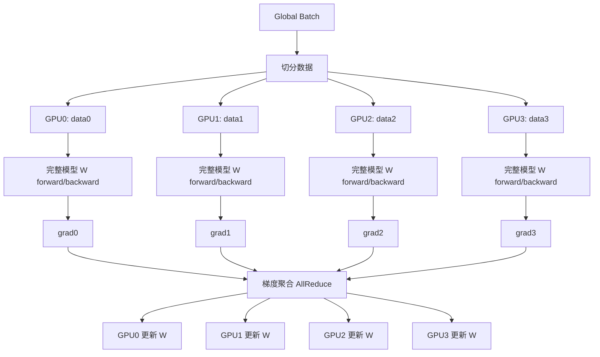
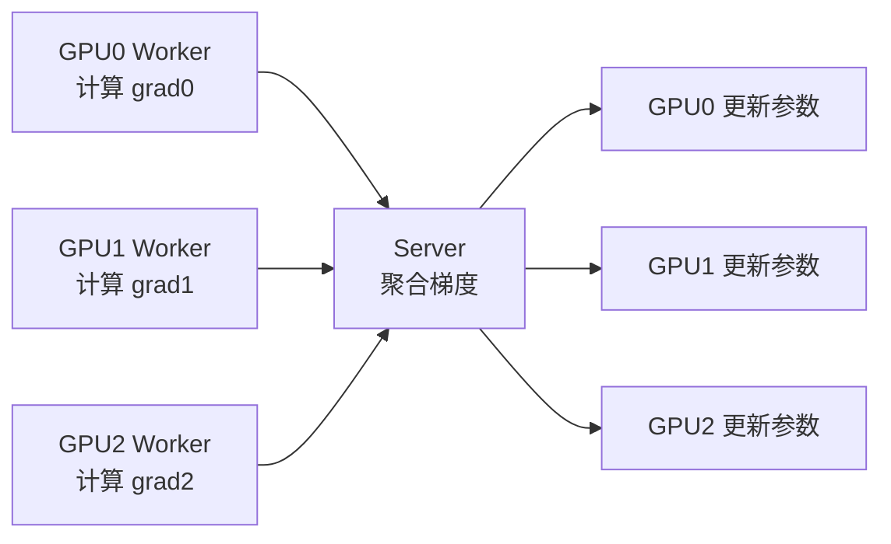
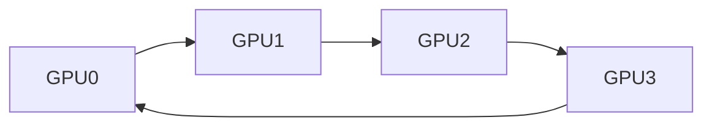
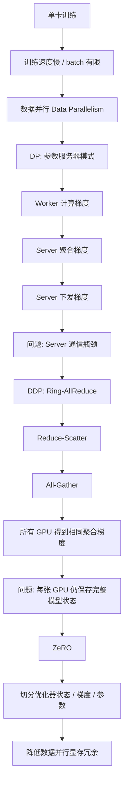

# 图解大模型训练之：数据并行上篇（DP、DDP 与 ZeRO）
## 1. 文章主题概览

这篇博客主要讲的是 **大模型训练中的数据并行 Data Parallelism**。

核心问题是：

> 当我们有多张 GPU 时，如何让它们一起训练一个模型？

数据并行的基本思想是：

```text
每张 GPU 都保存一份完整模型；
每张 GPU 处理不同的数据；
每张 GPU 各自计算梯度；
然后把所有 GPU 的梯度聚合；
最后每张 GPU 用相同的聚合梯度更新参数。
```

这篇文章主要介绍三种数据并行相关方法：

| 方法 | 全称 | 核心特点 |
|---|---|---|
| **DP** | Data Parallelism | 传统数据并行，常用参数服务器模式 |
| **DDP** | Distributed Data Parallelism | 分布式数据并行，常用 Ring-AllReduce 同步梯度 |
| **ZeRO** | Zero Redundancy Optimizer | 零冗余优化器，减少数据并行中的显存冗余 |

---

# 2. 为什么需要数据并行？

在单卡训练中，流程是：

```text
一个 batch
    ↓
GPU0 上完整模型 forward
    ↓
计算 loss
    ↓
backward 得到梯度
    ↓
optimizer 更新参数
```

问题是：

1. **单卡算得慢**
2. **单卡 batch size 有限**
3. **单卡吞吐不够**
4. **大模型训练时间太长**

所以我们希望多张 GPU 一起工作。

数据并行的目标不是把模型切开，而是：

> **把数据切开，让多张 GPU 同时处理不同数据。**

---

# 3. 数据并行的核心思想

假设有 4 张 GPU，一个 global batch 有 4 份数据：

```text
Global Batch = [x0, x1, x2, x3]
```

数据并行会把它们分给不同 GPU：

```text
GPU0: x0
GPU1: x1
GPU2: x2
GPU3: x3
```

但是每张 GPU 上都有一份完整模型：

```text
GPU0: 完整模型 W
GPU1: 完整模型 W
GPU2: 完整模型 W
GPU3: 完整模型 W
```

然后每张 GPU 各自计算：

```text
GPU0: forward(x0) → loss0 → backward → grad0
GPU1: forward(x1) → loss1 → backward → grad1
GPU2: forward(x2) → loss2 → backward → grad2
GPU3: forward(x3) → loss3 → backward → grad3
```

最后把梯度聚合：

```text
grad = (grad0 + grad1 + grad2 + grad3) / 4
```

然后每张 GPU 都用同一个 `grad` 更新参数：

```text
W = W - lr * grad
```

这样更新完成后，所有 GPU 上的模型参数仍然保持一致。

---

# 4. 数据并行的完整流程图



---

# 5. DP：传统数据并行

## 5.1 DP 的基本思想

传统 DP 通常可以理解成 **参数服务器 Parameter Server** 模式。

它里面有两类角色：

| 角色 | 作用 |
|---|---|
| **Worker** | 负责 forward、backward，计算本地梯度 |
| **Server** | 负责收集梯度、聚合梯度、下发结果 |

假设有 4 张 GPU：

```text
GPU0: Worker
GPU1: Worker
GPU2: Worker
GPU3: Server
```

每个 Worker 上都有一份完整模型：

```text
GPU0: W
GPU1: W
GPU2: W
```

每个 Worker 拿不同的数据：

```text
GPU0: data0
GPU1: data1
GPU2: data2
```

然后各自算梯度：

```text
GPU0: grad0
GPU1: grad1
GPU2: grad2
```

之后把梯度发给 Server：

```text
grad0 ┐
grad1 ├──> Server 聚合
grad2 ┘
```

Server 聚合得到：

```text
grad = grad0 + grad1 + grad2
```

或者平均：

```text
grad = (grad0 + grad1 + grad2) / 3
```

然后 Server 再把聚合后的梯度发回所有 Worker。

---

## 5.2 DP 流程图



---

## 5.3 DP 的优点

DP 的优点是：

1. **思想简单**
2. **实现直接**
3. **适合早期单机多卡场景**
4. **每张卡计算逻辑和单卡训练很像**

---

## 5.4 DP 的问题

DP 有两个核心问题。

---

### 问题一：显存冗余

每张 GPU 都保存完整模型：

```text
GPU0: W
GPU1: W
GPU2: W
GPU3: W
```

这意味着模型状态被复制了多份。

训练时显存里不只有参数，还包括：

```text
参数 Parameters
梯度 Gradients
优化器状态 Optimizer States
中间激活 Activations
```

如果模型很大，每张卡都保存完整模型状态会非常浪费。

---

### 问题二：Server 通信瓶颈

DP 中所有 Worker 都要和 Server 通信：

```text
GPU0 → Server
GPU1 → Server
GPU2 → Server
GPU3 → Server
...
```

Server 既要接收所有梯度，又要把聚合结果发回所有 GPU。

所以 Server 会变成通信瓶颈。

可以类比成：

```text
所有快递都先送到一个中转站；
再由这个中转站发给所有人；
中转站的带宽和处理能力就会成为瓶颈。
```

GPU 数量越多，这个问题越严重。

---

# 6. 同步更新与异步更新

## 6.1 同步更新

同步数据并行中，所有 GPU 都要等彼此。

流程是：

```text
所有 GPU 计算本地梯度
    ↓
所有 GPU 等待梯度聚合
    ↓
所有 GPU 拿到相同聚合梯度
    ↓
所有 GPU 同步更新参数
    ↓
进入下一轮训练
```

优点：

```text
训练稳定，梯度一致性强。
```

缺点：

```text
如果某张 GPU 慢，其他 GPU 都要等它。
```

---

## 6.2 异步更新

异步更新的思想是：

> Worker 不一定等待最新梯度回来，可以继续往下计算。

例如：

```text
Worker 用 W10 算出 grad10
    ↓
把 grad10 发给 Server
    ↓
不等 Server 返回结果，继续用旧参数计算下一轮
```

这样可以减少等待时间，提高计算利用率。

但是问题是：

> 梯度可能过期。

也就是：

```text
当前模型参数已经变成 W12 了，
但是用来更新的梯度可能还是 W10 时候算出来的。
```

这种梯度叫做 **stale gradient，过期梯度**。

---

## 6.3 异步更新为什么可能影响收敛？

可以把训练过程理解成下山。

同步训练像这样：

```text
当前位置看坡度
    ↓
按当前坡度走一步
    ↓
到新位置再看新坡度
```

异步训练像这样：

```text
你已经走到新位置了，
但是还在根据旧位置的坡度决定方向。
```

如果旧梯度延迟很小，影响不大。

如果延迟很大，模型更新方向可能不准确，导致：

```text
收敛变慢
训练震荡
甚至不稳定
```

---

# 7. DDP：分布式数据并行

## 7.1 DDP 要解决什么问题？

DP 的核心瓶颈是：

```text
Server 通信压力太大。
```

所以 DDP 的目标是：

> **去掉中心化 Server，把通信压力分摊到所有 GPU 上。**

DDP 仍然是数据并行。

它和 DP 的共同点是：

```text
每张 GPU 都保存完整模型；
每张 GPU 处理不同数据；
每张 GPU 各自计算梯度；
最后同步梯度。
```

不同点是：

```text
DP: 用中心 Server 聚合梯度
DDP: 用 AllReduce，尤其是 Ring-AllReduce 聚合梯度
```

---

## 7.2 DDP 的基本流程

假设有 4 张 GPU：

```text
GPU0: 完整模型 W，处理 data0
GPU1: 完整模型 W，处理 data1
GPU2: 完整模型 W，处理 data2
GPU3: 完整模型 W，处理 data3
```

每张 GPU 都算出一份完整梯度：

```text
GPU0: grad0
GPU1: grad1
GPU2: grad2
GPU3: grad3
```

然后通过 Ring-AllReduce 让所有 GPU 都得到聚合后的梯度：

```text
grad = grad0 + grad1 + grad2 + grad3
```

或者平均梯度：

```text
grad = (grad0 + grad1 + grad2 + grad3) / 4
```

最后每张 GPU 都用相同的梯度更新自己的模型副本。

---

# 8. AllReduce 是什么？

AllReduce 可以拆成两个词：

```text
All + Reduce
```

含义是：

| 词 | 含义 |
|---|---|
| **Reduce** | 把多个 GPU 的梯度聚合起来 |
| **All** | 所有 GPU 最后都拿到聚合结果 |

假设有 4 张 GPU，各自有梯度：

```text
GPU0: grad0
GPU1: grad1
GPU2: grad2
GPU3: grad3
```

AllReduce 之后，每张 GPU 都会得到：

```text
grad_sum = grad0 + grad1 + grad2 + grad3
```

结果是：

```text
GPU0: grad_sum
GPU1: grad_sum
GPU2: grad_sum
GPU3: grad_sum
```

如果框架做平均，那么每张 GPU 得到的是：

```text
grad_avg = (grad0 + grad1 + grad2 + grad3) / 4
```

---

# 9. Ring-AllReduce 是什么？

## 9.1 Ring 的含义

Ring-AllReduce 中的 Ring 是环形通信。

假设有 4 张 GPU：

```text
GPU0 → GPU1 → GPU2 → GPU3
 ↑                    ↓
 └────────────────────┘
```

每张 GPU 只和相邻 GPU 通信：

```text
GPU0 和 GPU1、GPU3 通信
GPU1 和 GPU0、GPU2 通信
GPU2 和 GPU1、GPU3 通信
GPU3 和 GPU2、GPU0 通信
```

这样就不需要一个中心 Server。

---

## 9.2 Ring-AllReduce 的直观流程



每张 GPU 都参与通信。

通信压力不会集中到某一个节点上，而是均匀分散。

---

# 10. Ring-AllReduce 的两个阶段

Ring-AllReduce 通常分成两个阶段：

```text
1. Reduce-Scatter
2. All-Gather
```

可以这样记：

```text
Reduce-Scatter：边聚合，边分散
All-Gather：把分散的聚合结果再收集完整
```

---

## 10.1 第一阶段：Reduce-Scatter

假设每张 GPU 的梯度都被切成 4 块：

```text
GPU0: [a0, b0, c0, d0]
GPU1: [a1, b1, c1, d1]
GPU2: [a2, b2, c2, d2]
GPU3: [a3, b3, c3, d3]
```

最终我们想要得到完整聚合梯度：

```text
[
  a0+a1+a2+a3,
  b0+b1+b2+b3,
  c0+c1+c2+c3,
  d0+d1+d2+d3
]
```

Reduce-Scatter 阶段会先让每张 GPU 得到其中一块聚合结果。

例如：

```text
GPU0: A_sum = a0 + a1 + a2 + a3
GPU1: B_sum = b0 + b1 + b2 + b3
GPU2: C_sum = c0 + c1 + c2 + c3
GPU3: D_sum = d0 + d1 + d2 + d3
```

此时每张 GPU 只有完整聚合梯度的一部分。

---

## 10.2 第二阶段：All-Gather

经过 Reduce-Scatter 后：

```text
GPU0: [A_sum]
GPU1: [B_sum]
GPU2: [C_sum]
GPU3: [D_sum]
```

但是最终每张 GPU 都需要完整梯度：

```text
[A_sum, B_sum, C_sum, D_sum]
```

所以 All-Gather 阶段就是让每张 GPU 互相交换已经聚合好的梯度块。

最后变成：

```text
GPU0: [A_sum, B_sum, C_sum, D_sum]
GPU1: [A_sum, B_sum, C_sum, D_sum]
GPU2: [A_sum, B_sum, C_sum, D_sum]
GPU3: [A_sum, B_sum, C_sum, D_sum]
```

这样每张 GPU 都拿到了相同的完整聚合梯度。

---

# 11. 我们讨论过的重点：a、b、c、d 到底是什么？

这一点非常容易误解。

前面写的：

```text
GPU0: [a0, b0, c0, d0]
GPU1: [a1, b1, c1, d1]
GPU2: [a2, b2, c2, d2]
GPU3: [a3, b3, c3, d3]
```

这里的 **a、b、c、d 不是输入数据**。

它们是：

> **每张 GPU 算出来的梯度张量被切成的不同分块。**

---

## 11.1 DDP 中真正的数据划分是什么？

假设一个 global batch 里有 4 个样本：

```text
batch = [样本0, 样本1, 样本2, 样本3]
```

DDP 会把它们分给 4 张 GPU：

```text
GPU0: 样本0
GPU1: 样本1
GPU2: 样本2
GPU3: 样本3
```

每张 GPU 都有完整模型：

```text
GPU0: W
GPU1: W
GPU2: W
GPU3: W
```

然后每张 GPU 根据自己的数据算出一份完整梯度：

```text
GPU0: grad0
GPU1: grad1
GPU2: grad2
GPU3: grad3
```

---

## 11.2 a、b、c、d 是梯度分块

假设 GPU0 算出来的梯度是：

```text
grad0 = [g0, g1, g2, g3, g4, g5, g6, g7]
```

为了 Ring-AllReduce 通信方便，可以把它切成 4 块：

```text
grad0 = [a0, b0, c0, d0]
```

也就是：

```text
a0 = grad0 的第 1 段
b0 = grad0 的第 2 段
c0 = grad0 的第 3 段
d0 = grad0 的第 4 段
```

同理：

```text
grad1 = [a1, b1, c1, d1]
grad2 = [a2, b2, c2, d2]
grad3 = [a3, b3, c3, d3]
```

所以：

```text
a、b、c、d 表示梯度的位置分块；
0、1、2、3 表示来自哪张 GPU。
```

---

## 11.3 a0、a1、a2、a3 之间是什么关系？

它们对应的是 **同一段模型参数的梯度**，只是来自不同 GPU 的不同数据。

假设模型参数可以分成 4 段：

```text
W = [W_a, W_b, W_c, W_d]
```

那么：

```text
a0 = GPU0 根据 data0 算出来的 W_a 的梯度
a1 = GPU1 根据 data1 算出来的 W_a 的梯度
a2 = GPU2 根据 data2 算出来的 W_a 的梯度
a3 = GPU3 根据 data3 算出来的 W_a 的梯度
```

所以它们要聚合：

```text
A_sum = a0 + a1 + a2 + a3
```

或者平均：

```text
A_avg = (a0 + a1 + a2 + a3) / 4
```

同理：

```text
B_avg = (b0 + b1 + b2 + b3) / 4
C_avg = (c0 + c1 + c2 + c3) / 4
D_avg = (d0 + d1 + d2 + d3) / 4
```

---

## 11.4 不同 GPU 的数据之间有关联吗？

**输入数据之间本身不要求有关联。**

DDP 只是把一个大 batch 拆给不同 GPU。

例如：

```text
GPU0: 样本0
GPU1: 样本1
GPU2: 样本2
GPU3: 样本3
```

这些样本就是训练集里的不同样本。

真正有关联的是：

> **不同 GPU 算出来的梯度必须对应同一份模型参数。**

也就是说：

```text
a0、a1、a2、a3 都对应 W_a 的梯度
b0、b1、b2、b3 都对应 W_b 的梯度
c0、c1、c2、c3 都对应 W_c 的梯度
d0、d1、d2、d3 都对应 W_d 的梯度
```

所以最终要把同一位置的梯度相加或平均。

---

# 12. 用一个小例子彻底理解 a、b、c、d

假设模型只有 4 个参数：

```text
W = [w1, w2, w3, w4]
```

4 张 GPU 各自处理不同样本：

```text
GPU0: x0
GPU1: x1
GPU2: x2
GPU3: x3
```

每张 GPU 都算完整梯度：

```text
GPU0: grad0 = [∂loss0/∂w1, ∂loss0/∂w2, ∂loss0/∂w3, ∂loss0/∂w4]
GPU1: grad1 = [∂loss1/∂w1, ∂loss1/∂w2, ∂loss1/∂w3, ∂loss1/∂w4]
GPU2: grad2 = [∂loss2/∂w1, ∂loss2/∂w2, ∂loss2/∂w3, ∂loss2/∂w4]
GPU3: grad3 = [∂loss3/∂w1, ∂loss3/∂w2, ∂loss3/∂w3, ∂loss3/∂w4]
```

为了简写，记成：

```text
GPU0: [a0, b0, c0, d0]
GPU1: [a1, b1, c1, d1]
GPU2: [a2, b2, c2, d2]
GPU3: [a3, b3, c3, d3]
```

对应关系是：

```text
a0 = ∂loss0/∂w1
a1 = ∂loss1/∂w1
a2 = ∂loss2/∂w1
a3 = ∂loss3/∂w1
```

所以 `w1` 的最终梯度应该是：

```text
a_avg = (a0 + a1 + a2 + a3) / 4
```

同理：

```text
b_avg = (b0 + b1 + b2 + b3) / 4
c_avg = (c0 + c1 + c2 + c3) / 4
d_avg = (d0 + d1 + d2 + d3) / 4
```

最后每张 GPU 都拿到：

```text
[a_avg, b_avg, c_avg, d_avg]
```

然后每张 GPU 用相同的梯度更新自己的模型副本。

---

# 13. DDP 为什么比 DP 更好？

DP 的通信模式是中心化的：

```text
Worker0 ┐
Worker1 ├──> Server
Worker2 ┘
```

Server 压力很大。

DDP 的 Ring-AllReduce 是去中心化的：

```text
GPU0 → GPU1 → GPU2 → GPU3
 ↑                    ↓
 └────────────────────┘
```

每张 GPU 都承担一部分通信压力。

因此 DDP 的优势是：

1. **没有中心 Server**
2. **通信压力均匀分摊**
3. **更适合多机多卡**
4. **扩展性比传统 DP 更好**

---

# 14. DP 和 DDP 的对比

| 对比项 | DP | DDP |
|---|---|---|
| 并行思想 | 数据并行 | 数据并行 |
| 模型存储 | 每张 GPU 一份完整模型 | 每张 GPU 一份完整模型 |
| 数据处理 | 每张 GPU 处理不同数据 | 每张 GPU 处理不同数据 |
| 梯度同步方式 | 参数服务器 / 中心节点聚合 | AllReduce / Ring-AllReduce |
| 通信压力 | 集中在 Server | 分散到所有 GPU |
| 适用场景 | 单机多卡较常见 | 单机多卡、多机多卡都常见 |
| 主要问题 | Server 瓶颈明显 | 仍然存在显存冗余 |

---

# 15. DDP 仍然存在的问题

虽然 DDP 解决了 DP 的通信瓶颈，但是普通 DDP 仍然有一个大问题：

> **每张 GPU 都保存完整模型状态。**

训练时的模型状态包括：

```text
参数 Parameters
梯度 Gradients
优化器状态 Optimizer States
```

以 Adam 优化器为例，除了参数本身，还要保存：

```text
一阶动量 m
二阶动量 v
```

所以每个参数不只是占一份显存。

普通 DDP 中，每张 GPU 都要保存完整的：

```text
完整参数
完整梯度
完整优化器状态
```

这会造成严重的显存冗余。

---

# 16. ZeRO：零冗余优化器

## 16.1 ZeRO 要解决什么问题？

ZeRO 的目标是：

> **减少数据并行中的冗余存储。**

普通 DDP 的问题是：

```text
GPU0: 完整参数 + 完整梯度 + 完整优化器状态
GPU1: 完整参数 + 完整梯度 + 完整优化器状态
GPU2: 完整参数 + 完整梯度 + 完整优化器状态
GPU3: 完整参数 + 完整梯度 + 完整优化器状态
```

这些内容在每张 GPU 上都重复保存。

ZeRO 的思想是：

```text
既然每张 GPU 都保存完整状态太浪费，
那就把这些状态切分到不同 GPU 上。
```

---

## 16.2 ZeRO 的直观理解

普通 DDP：

```text
GPU0: [完整模型状态]
GPU1: [完整模型状态]
GPU2: [完整模型状态]
GPU3: [完整模型状态]
```

ZeRO：

```text
GPU0: [模型状态的 1/4]
GPU1: [模型状态的 1/4]
GPU2: [模型状态的 1/4]
GPU3: [模型状态的 1/4]
```

这样每张 GPU 的显存压力就下降了。

---

## 16.3 ZeRO 和 DDP 的关系

ZeRO 不是简单替代 DDP，而是在数据并行基础上进一步优化显存。

可以这样理解：

```text
DDP 解决的是：
多张 GPU 怎么同步梯度，怎么避免中心 Server 通信瓶颈。

ZeRO 解决的是：
数据并行中每张 GPU 都保存完整训练状态太浪费怎么办。
```

---

# 17. 文章主线总结

这篇文章的逻辑主线是：

```text
单卡训练太慢
    ↓
引入数据并行
    ↓
每张 GPU 放完整模型，处理不同数据
    ↓
传统 DP 用参数服务器聚合梯度
    ↓
DP 的 Server 通信压力大
    ↓
DDP 用 Ring-AllReduce 去掉中心 Server
    ↓
DDP 通信压力更均匀，适合多机多卡
    ↓
但是 DDP 仍然有显存冗余
    ↓
ZeRO 用切分模型状态的方式降低冗余存储
```

---

# 18. 总流程图



---

# 19. 面试版回答

如果面试官问：

> DP 和 DDP 有什么区别？

可以回答：

```text
DP 和 DDP 本质上都是数据并行。
它们都会在每张 GPU 上保存一份完整模型，
不同 GPU 处理不同数据，
各自完成 forward 和 backward 得到本地梯度，
然后同步梯度，保证每张 GPU 的参数更新一致。

区别在于梯度同步方式。
传统 DP 通常使用参数服务器模式，
Worker 把梯度发送给中心 Server，
Server 聚合后再发回 Worker。
这种方式简单，但 Server 会成为通信瓶颈。

DDP 使用 AllReduce，常见实现是 Ring-AllReduce。
它不依赖中心 Server，而是让所有 GPU 组成通信环，
通过 Reduce-Scatter 和 All-Gather 完成梯度聚合。
这样通信压力被分摊到所有 GPU 上，
因此更适合多机多卡训练。
```

---

如果面试官问：

> Ring-AllReduce 为什么要把梯度切成 a、b、c、d？

可以回答：

```text
a、b、c、d 不是数据分块，而是梯度张量的分块。
每张 GPU 都会根据自己的数据算出一份完整梯度，
为了通信高效，会把完整梯度切成多个 chunk。

例如 GPU0 的梯度记为 [a0, b0, c0, d0]，
GPU1 的梯度记为 [a1, b1, c1, d1]。
其中 a0、a1、a2、a3 对应同一段模型参数的梯度，
只是来自不同 GPU 的不同数据。

Ring-AllReduce 会把同一位置的梯度块聚合，
例如得到 a0+a1+a2+a3，
最终让每张 GPU 都拿到完整的聚合梯度。
```

---

如果面试官问：

> DDP 中不同 GPU 的数据之间有关联吗？

可以回答：

```text
不同 GPU 的输入数据本身不要求有关联。
它们只是 global batch 被切分后的不同样本。

真正有关联的是梯度的位置。
因为每张 GPU 上模型结构相同，
所以它们算出来的梯度张量位置是一一对应的。

例如 a0、a1、a2、a3 都是同一段参数的梯度，
所以它们需要聚合；
b0、b1、b2、b3 也是同一段参数的梯度，
也需要聚合。
```

---

如果面试官问：

> ZeRO 解决了什么问题？

可以回答：

```text
普通 DDP 仍然存在显存冗余问题。
每张 GPU 都保存完整的参数、梯度和优化器状态。
对于大模型训练来说，优化器状态尤其占显存，
例如 Adam 需要保存一阶动量和二阶动量。

ZeRO 的核心思想是把这些模型状态切分到不同 GPU 上，
让每张 GPU 只保存一部分参数、梯度或优化器状态，
从而降低数据并行中的冗余显存开销。
```

---

# 20. 最重要的记忆版总结

```text
DP / DDP 都是数据并行：
每张 GPU 保存完整模型，处理不同数据，最后同步梯度。

DP 的问题：
用中心 Server 聚合梯度，Server 通信压力大。

DDP 的改进：
用 Ring-AllReduce 去掉中心 Server，
通过 Reduce-Scatter + All-Gather 同步梯度，
让通信压力分摊到所有 GPU。

a、b、c、d 不是数据，而是梯度分块。
a0、a1、a2、a3 对应同一段参数的梯度，
只是来自不同 GPU 的不同数据，所以要聚合。

DDP 的剩余问题：
每张 GPU 仍然保存完整参数、梯度和优化器状态，显存冗余大。

ZeRO 的目标：
把优化器状态、梯度、参数切分到不同 GPU 上，
减少数据并行的冗余存储。
```