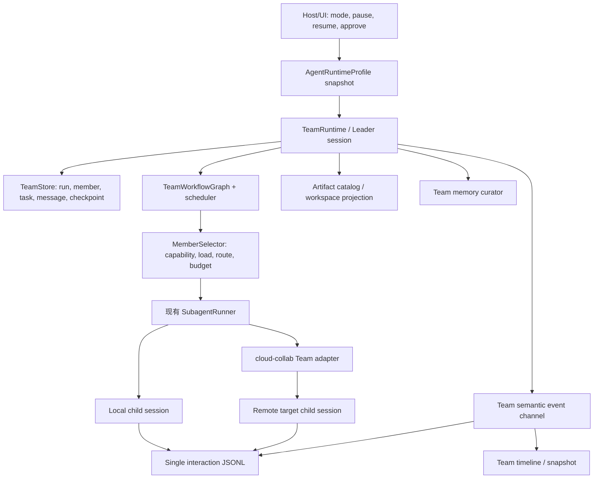

# 原始 TaiChu、当前增强版 TaiChu 与 JiuwenSwarm Agent/Team 对标分析


## 1. 一句话结论

三方的关系可以概括为：

- **原始 TaiChu**：Agent、Planner、SubAgent、跨设备协同和 interaction trace 底座较强，但没有 Team 执行子系统。
- **当前增强版 TaiChu**：在原始 TaiChu 上新增了一个经过测试的 **Local Agent Team 最小执行内核**，第一次把 Planner DAG 与 SubAgent runner 组合成 leader/teammate 并行执行闭环；这是对标 JiuwenSwarm Team 的第一步，但还不是可供用户直接切换的 Team 产品模式。
- **JiuwenSwarm**：在 Team 产品化、动态组队、任务/消息控制面、团队 workspace、团队记忆、Swarm Skills、模式系统和分布式成员生命周期方面明显领先，但底层较多依赖 openJiuwen，当前分布式实现也有静默降级、单活动 session、跨机 workspace 不共享和 bootstrap 复杂度过高等工程债。

当前增强版最准确的定位不是“已经实现 JiuwenSwarm”，而是：

> **完成了从“只有独立 SubAgent”到“可以按 DAG 并行调度多个角色化 SubAgent”的关键跨越，补齐了 Team execution primitive；尚未补齐 Team control plane、产品入口与团队资产层。**

## 2. 分析口径与基线限制

本报告中的“Agent/Team 模式”覆盖：

- 单 Agent while-loop、plan/fast/code 等运行策略；
- SubAgent 前台/后台委派；
- Leader/Teammate Team 的组队、任务图、调度、消息、状态与恢复；
- Team workspace、artifact、memory、Skill；
- 分布式成员发现、bootstrap、lease、回收；
- 权限、验证、可观测性和用户产品入口。

分析方法：

1. 对原始 TaiChu 与当前增强版进行逐文件 checksum/diff；
2. 将差异限定到源码、配置模板、文档和测试，排除 `build/`、`target/`、HAR、日志、`.DS_Store` 等生成物；
3. 核对 JiuwenSwarm 文档、TeamManager、分布式 bootstrap、workflow state、Swarm 装配和相关测试；
4. 不以 README 宣传语单独作为实现事实。

## 3. 三方能力总览

| 维度 | 原始 TaiChu | 当前增强版 TaiChu | JiuwenSwarm |
|---|---|---|---|
| 单 Agent loop | 成熟 Rust while-loop | 与原始版一致 | ReAct + 外层 Task Loop |
| Planner | 1–3 步 rolling DAG，默认关闭 | 与原始版一致，并被 Team runner 复用 | 默认 plan 模式 + 持久 todo + plan approval |
| SubAgent | 本地/远程、前后台、真实 target child session | 与原始版一致 | 同步 task tool + 异步 session tools |
| Team 执行内核 | **没有** | **新增 LocalTeamRunner + DAG scheduler + teammate runner** | 完整 TeamAgent/runtime |
| Team 产品模式 | 没有 | 没有，仍是 SDK API + feature gate | Web/TUI/频道 first-class `team`/`code.team` |
| 成员定义 | 只有独立 SubAgent profile | 静态 `TeamMember(id, profile, route)` | Leader 动态 build/spawn + predefined member |
| 任务分配 | 无 Team 分配 | round-robin | 角色/任务驱动、认领、消息协同 |
| 任务状态 | Planner 内存状态 | Team 复用内存 PlanStore | Team storage、snapshot/history、workflow checkpoint |
| 成员通信 | 无 | 无 | P2P、broadcast、Leader/Teammate 消息 |
| Team workspace | 无 | 无 | team workspace + member workspace |
| Team artifact | 远程文件传输工具，但无 Team contract | step 间传 summary | 共享 artifact 目录；跨机仍非物理共享 |
| Team memory | 无 | 无 | member memory + `TEAM_MEMORY.md` + round extraction |
| Team Skill/SOP | 无 | 无 | 五文件 Swarm Skill + Hub/validator/evolution |
| 分布式 Team | Remote SubAgent 基础可用 | 可注入 remote runner，但无成员生命周期 | A2X reserve + ZMQ bootstrap + shared storage |
| Team 事件 | 无 | 新增进程内 `TeamEvent` 和 `TEAM_CALL_CHAIN` | member/task/message/workflow UI 事件 |
| Team 测试 | 无 | 新增 10 个集成测试，当前全部通过 | 大量 unit/system Team 测试 |
| 权限治理 | ToolDomains、path guard、app hooks | 与原始版一致 | 参数级 allow/ask/deny + HITL/override |
| Trace | 单一 interaction JSONL，较强 | teammate 继承同一 JSONL | Team UI/OTLP 较强，统一模型事实链不如 TaiChu 明确 |

## 4. 原始 TaiChu 的 Agent 基础

### 4.1 已有优势：不是从零开始

原始 TaiChu 已经是一套边界较清晰的 Agent Harness：

```text
taichu-core-sdk
  → agent-framework（session、prompt、tool assembly、runtime SPI）
    → agent-session（历史、compaction、interactive lifecycle）
      → agent-loop（LLM → tool → observation while-loop）
        → llm-provider / builtintools / host tools
```

它已经具备：

- 多轮 LLM-tool while-loop；
- steer、follow-up、abort/cancel；
- 工具 schema 校验、并发策略和进度事件；
- session JSONL/DB、compaction、模型切换和恢复；
- prompt builder、persona、Skill metadata 与 `load_skill`；
- runtime/session/turn/tool 生命周期 hook；
- guard/observer/rewrite/deferred guard；
- memory plugin lifecycle；
- 本地/远程、前台/后台 SubAgent；
- cloud-collab presence/discovery/relay/file transfer；
- main agent、SubAgent、app_controller 单一 interaction JSONL。

这些能力意味着原始 TaiChu 与 JiuwenSwarm 的差距主要不在“能否运行 Agent”，而在 **是否把多个 Agent 组织成可持续、可恢复、可观察的团队**。

### 4.2 Planner 已存在，但没有变成 Team

原始 TaiChu 已有 Planner：

- root prompt 可生成 1–3 步 rolling DAG；
- 计划状态通过 `update_plan` 在同一个主 Agent while-loop 内更新；
- 不把完整计划注入真实 UserMessage；
- 有 DAG validator、scheduler、retry、cancel、run/step state。

但 Planner 默认关闭，`PlanStore` 只是进程内 `HashMap`。更重要的是，原始版没有把 planner scheduler 接到 SubAgent：

```text
原始版：Planner 与 SubAgent 各自存在
        Planner ── 管计划状态
        SubAgent ── 执行单次委派
        两者之间没有 Team bridge
```

因此原始版可以“让主 Agent 自己维护计划”，也可以“让主 Agent调用一个 SubAgent”，但不能直接表达“Leader 生成 DAG，多个 teammate 并行执行不同 step”。

### 4.3 SubAgent 是原始版最重要的 Team 基座

原始 TaiChu SubAgent 已形成统一执行契约：

- `run_subagent` 统一本地/远程、前台/后台；
- target Runtime 创建真实 child session，source 不伪造远端 child；
- `SubagentRunRequest`、`SubagentProgressEvent`、`SubagentRunResult` 统一本地和远程；
- 支持 timeout、max turns、cancel、resume、后台 task list/output/stop；
- child 工具集受 target Runtime 已装配能力约束；
- child 继承 parent interaction log path/write lock；
- 远程链路已有发现、relay 和文件传输。

这也是当前增强版选择“组合现有 Planner + SubAgent”而不是另写 Agent loop 的正确基础。

### 4.4 原始版相对 JiuwenSwarm 的核心缺口

原始版没有以下 Team 层概念：

- Team runtime / Team session；
- Leader/Teammate 成员集合；
- plan step 到 member 的 assignment；
- Team run/step/member lifecycle event；
- Team task/message/workflow store；
- Team workspace/artifact；
- Team memory；
- Team Skill；
- remote member lease/bootstrap/reconnect/teardown；
- 用户可切换的 `team`/`code.team` 模式和 Team UI。

因此原始 TaiChu 对标 JiuwenSwarm 的第一优先级，本来应该是 **先建立一个不破坏现有边界的 Team execution kernel**。当前增强版正好完成了这一层。

## 5. 当前增强版相对原始 TaiChu 做了什么

### 5.1 差异范围

排除生成文件和本报告后，当前增强版 Agent 相关的实质源码差异集中在：

| 文件/目录 | 变化 |
|---|---|
| `core/subagent/src/team/` | 新增 `executor.rs`、`runtime.rs`、`types.rs`、`mod.rs` |
| `core/subagent/tests/local_team.rs` | 新增 Local Team 集成测试 |
| `core/subagent/Cargo.toml` | 接入 `planner`、`thiserror` 和测试依赖 |
| `core/subagent/src/lib.rs` | 导出 `team` 模块 |
| `core/taichu-core-sdk/src/lib.rs` | 通过稳定 SDK surface 导出 Team API 和 planning strategy |
| `.feature.json` | 新增 `team.teammate.profile.enabled=false` |
| `libs/taichu-feature-config` | 注册/校验 Team feature key |
| OHOS feature template | 同步 Team feature key |
| `docs/architecture/local-agent-team.md` | 新增代码对齐设计文档 |
| `docs/README.md`、feature guide | 增加索引和开关说明 |
| Cargo lockfiles | 依赖闭包机械更新 |

Team 生产源码约 807 行，针对性测试 882 行，设计文档 162 行。

### 5.2 新增的 Local Agent Team 执行链

当前增强版新增了：

```mermaid
flowchart LR
    G["复合目标"] --> L["LocalTeamRunner"]
    L --> P["现有 Planner / PlanningStrategy"]
    P --> D["PlanGraph DAG"]
    D --> S["现有 planner scheduler"]
    S --> E["TeammateStepExecutor"]
    E --> M["round-robin TeamMember"]
    M --> R["Local 或注入的 Remote SubagentRunner"]
    R --> C["真实 child session"]
    C --> A["按原始 plan 顺序聚合结果"]
```



关键新增类型：

- `LocalTeamRunner`：规划、调度、读取 run state、聚合结果；
- `TeammateStepExecutor`：把 `PlanStep` 转换为 `SubagentRunRequest`；
- `TeamMember`：`id + profile_id + Local/Remote route`；
- `TeamEvent`：`RunStarted/StepAssigned/StepProgress/StepFinished/RunFinished`；
- `TeamRunResult/TeamStepResult`：保留每步状态、summary、error、execution id；
- `TeamError`：disabled/config/planning/missing-state 领域错误。

### 5.3 对标 JiuwenSwarm 已经补齐的部分

| JiuwenSwarm 能力方向 | 原始 TaiChu | 当前增强版贡献 | 对标程度 |
|---|---|---|---|
| Leader 将复合目标拆为团队任务 | Planner 独立存在 | `LocalTeamRunner` 调 Planner 生成 Team DAG | 部分补齐 |
| 多成员并行执行 | 只能单次 SubAgent 委派 | scheduler 按依赖和并发执行多个 teammate step | 核心补齐 |
| 角色化 teammate | 有 SubAgent profile，但无 Team member | `TeamMember.profile_id` 绑定现有 profile registry | 基础补齐 |
| 本地/远程统一成员执行 | Remote SubAgent 已存在 | `TeammateRoute` 选择 builtin/remote runner | 组合边界补齐 |
| 任务依赖和结果接力 | Planner DAG 存在 | upstream summary 前置到 dependent task | 最小补齐 |
| Team 生命周期事件 | 无 | 新增 run/assignment/progress/terminal event | 基础补齐 |
| Team 可观测性 | 只有通用 SubAgent trace | 新增脱敏 `TEAM_CALL_CHAIN`，继承同一 interaction JSONL | 较好补齐 |
| 配置与灰度 | 无 Team 开关 | `.feature.json` fail-fast feature gate，默认关闭 | 补齐 |
| 测试闭环 | 无 Team test | 新增 10 个集成测试，当前全部通过 | 补齐 |

### 5.4 当前新增设计中做得较好的地方

#### 复用现有架构，没有平行造轮子

新增代码没有引入第二套 planner、session、profile loader 或 Agent loop，而是用薄 bridge 组合：

```text
planner::StepExecutor → subagent::SubagentRunner
```

这符合 TaiChu 的 core/cloud 边界，也降低了后续把 Team 接入本地、移动端和云侧的分叉风险。

#### 真实 child session 和单一 trace 不变量得到保留

每个 teammate 仍经现有 SubAgent runner 创建真实 child session。`PlannerRunContext` 中的 parent session id、interaction log path 和共享写锁被传入 teammate request，避免 Team 形成第二份不可关联的模型日志。

#### 失败语义是显式的

只有 `SubagentTerminalStatus::Completed` 被映射为 step success。timeout、cancel、max turns、aborted、failed 不会被 summary 文本伪装成成功；非法 Team 配置和非法 DAG 在执行前 fail fast。

#### 隐私和日志边界较克制

`TEAM_CALL_CHAIN` 记录关联 id、route、计数、状态和耗时，不记录 goal、task、upstream context、profile 正文和原始模型内容。新增测试还验证了敏感字符串不进入 tracing 输出。

#### 测试覆盖真实行为

当前已执行：

```text
cargo test -p subagent --test local_team
```

结果：10 passed，覆盖：

- 自定义 profile 的本地 route；
- 注入 remote runner 的远程 route；
- 缺失 remote runner/重复成员/空 profile 等配置错误；
- feature disabled；
- 非法 DAG；
- DAG 并行、round-robin 和 plan-order aggregation；
- 非 Completed 终态与 dependent skip；
- cancellation；
- 日志脱敏。

### 5.5 当前新增只对标到 JiuwenSwarm 的哪一层

JiuwenSwarm 可以粗分为四层：

```text
L4 产品与生态：mode/UI/Swarm Skills Hub/Symphony/evolution
L3 团队资产：workspace/artifact/memory/skills/verification
L2 协作控制面：member/task/message/workflow/checkpoint/lease
L1 执行内核：leader plan → assign → parallel run → aggregate
```

当前增强版主要完成 **L1 执行内核**，并为 L2 提供了初始事件和 remote runner seam。L2–L4 基本仍未实现。

这是一条合理的增量路线，但不能把“可并行运行多个 SubAgent”直接等价成 JiuwenSwarm 的完整 Agent Team。

## 6. 当前增强版仍未对标 JiuwenSwarm 的部分

### 6.1 没有 first-class Team 产品入口

`LocalTeamRunner` 目前只在 `taichu-core-sdk` 导出和测试中出现。service、mobile、CLI、Flutter 没有通过稳定 mode 路由启动它；用户也不能在对话中切到 `team`。

JiuwenSwarm 则有：

- `agent.plan`、`agent.fast`、`code.normal`、`code.team`、`team`；
- Web/TUI 模式切换；
- 频道 `/mode team`；
- mode 决定 profile、Rails、tools、memory 和 Team runtime。

因此当前增强版是库能力，不是产品能力。

### 6.2 没有持久 Team control plane

当前 Team 继续使用 `PlanStore::new()`，存储是进程内 `HashMap`；`TeamEvent` 只是同步 callback。

缺少：

- Team run/member/task/message 表或 trait；
- snapshot/history API；
- workflow checkpoint；
- pause/restart/resume；
- attempt/lease reconciliation；
- late result、duplicate result 的幂等规则。

进程退出、端侧切后台或远程断连后，Team 无法恢复。

### 6.3 成员是静态的，分配只是 round-robin

`TeamMember` 由调用方预先构造；`next_teammate()` 用 `AtomicUsize % members.len()` 轮转。

它不考虑：

- role 与 task requirement；
- Skill/tool/device capability；
- 模型和上下文窗口；
- 本地/远程成本；
- 当前负载和并发上限；
- 历史质量、trust 和失败率；
- 失败后的替代成员。

JiuwenSwarm 的 Leader 动态 build/spawn、任务认领和角色配置至少提供了更完整的协调语义。

### 6.4 没有成员消息与动态协作

当前执行形态是“scheduler 派单—child 返回 summary”。Teammate 不能：

- 向 Leader 求助；
- 给另一个 teammate 发消息；
- 广播发现；
- 请求补充输入；
- 提交 review/approval；
- 根据新事实动态创建任务。

这使当前 Team 更接近 parallel map/DAG executor，而不是事件驱动团队。

### 6.5 没有 Team workspace 和 artifact contract

dependent step 只收到拼接后的 upstream summary。文件、大型数据、中间文档和结构化产物没有 Team 级引用与 provenance。

JiuwenSwarm 有 team workspace 和 member workspace，但其分布式文档也承认跨机默认仍是不同本地目录。TaiChu 后续不应简单复制“共享路径”，而应建立 immutable artifact handle + 现有 file transfer。

### 6.6 没有 Team memory

当前 teammate 不拥有 Team working memory 或 Team long-term memory。原始 TaiChu 的 memory plugin 只安装到 root session，SubAgent 默认不写用户长期记忆，以避免污染。

JiuwenSwarm 已提供：

- member private memory；
- 所有成员只读的 `TEAM_MEMORY.md`；
- persistent team round-end extraction；
- decision/lesson/member/context 分类；
- temporary/persistent lifecycle 隔离。

### 6.7 没有 Team Skill/SOP

当前 profile 只描述单个 teammate 的 persona、tool allowlist 和 prompt。它不能描述：

- 团队有哪些角色；
- 哪些步骤串行/并行；
- 质量门控与输出 schema；
- max members/token/time budget；
- timeout、缺成员、意见冲突等失败策略；
- 工具和 Skill 依赖；
- acceptance criteria。

JiuwenSwarm 的五文件 Swarm Skill 正好覆盖这些 Team-level contract。

### 6.8 Remote route 不是分布式 Team lifecycle

当前 `TeammateRoute::Remote` 只选择一个注入的 `SubagentRunner`。它没有：

- capability discovery 到 member reservation；
- lease/heartbeat；
- remote bootstrap；
- reconnect/rebind；
- idle/busy agent card；
- Team destroy 和资源释放。

JiuwenSwarm 的 A2X reserve + ZMQ bootstrap 在这一点上更完整；TaiChu 应参考生命周期，而不是照搬传输。

## 7. 当前新增实现自身值得改进的细节

这些问题不否定当前增量价值，但应在产品化前处理。

### 7.1 Feature key 语义过窄

`team.teammate.profile.enabled` 实际 gate 的是整个 `LocalTeamRunner::run()`，名称却像只控制 teammate profile。后续新增 Team mode、remote Team 或 Team Skill 时容易语义混乱。

建议在正式产品 contract 设计时使用更准确的开关层级，例如 `team.local_runtime.enabled`；是否迁移现有 key 需要单独兼容决策，不能静默加 fallback。

### 7.2 Run 事件关联字段不完全一致

`StepAssigned/StepProgress/StepFinished` 带 `parent_session_id`，但 `RunStarted/RunFinished` 没有。进程内 callback 尚可由调用方补上下文，持久化或多 Team 并行后会增加关联难度。

建议所有 Team semantic event 统一包含：

```text
root_session_id + team_run_id + plan_id + event_id + timestamp
```

step/member/task 事件再增加对应 id。

### 7.3 PlanStore 不可注入

`LocalTeamRunner::new()` 内部固定创建 `PlanStore::new()`，使调用方无法替换为持久 store，也不利于恢复测试。

建议未来 facade 接收 `TeamStore`/`PlanStore` abstraction；生产默认必须显式选择存储策略。

### 7.4 Round-robin 状态跨 run 累积

`next_member` 是 executor 级 `AtomicUsize`。同一个 executor 多次 run 时，首个 assignment 受前一 run 的调用次数影响。它保证轮转，但不是 run-scoped deterministic assignment。

产品化后应由 `MemberSelector` 接收 `team_run_id/task/available_members`，将选择结果和理由写入 store/event。

### 7.5 Retry 默认创建新 child，而不是恢复原 child

Team request 固定 `resume_from: None`。scheduler retry 再次 execute 时会创建新的 child session。对于只读分析问题不大，但涉及外部副作用时可能重复执行。

需要定义：

- attempt id 和 idempotency key；
- 哪些 task 可自动 retry；
- retry 是 resume 原 child、创建新 child，还是重新分配成员；
- side-effect tool 的 exactly-once/at-least-once 语义。

### 7.6 Upstream context 是自然语言拼接

当前 `step_prompt()` 把 upstream summary 与 task 拼接。它简单有效，但缺少结构化 source task、artifact、版本和大小预算。

建议保留 summary 作为模型视图，同时增加结构化 `TaskInput`/artifact references，避免后续依赖 prompt parsing 还原控制面事实。

### 7.7 同步 event callback 不能承担重 I/O

`TeamEventCallback` 是同步 `Fn(TeamEvent)`。如果未来 callback 直接写数据库、网络推送或慢日志，会阻塞 scheduler 路径。

建议 runtime 内通过 bounded channel 产生事件，由 projector/persister 异步消费；满载策略必须保证 terminal event 不丢失。

## 8. JiuwenSwarm 值得参考的能力

### 8.1 First-class 模式系统

JiuwenSwarm 的 mode 不只是 UI 标签，而是 runtime profile：

| 模式 | 行为重点 |
|---|---|
| `agent.plan` | 规划、SubAgent、主动记忆、Skill 演进 |
| `agent.fast` | 卸载重编排能力，偏快速响应 |
| `code.normal` | Code prompt、LSP、项目/编码记忆、权限与确认 |
| `code.team` | Code profile 上启动团队协作 |
| `team` | 标准 Leader/Teammate runtime |

TaiChu 可参考“profile snapshot 决定 planner/tools/memory/permission/team”，但不需要第一阶段复制全部 mode 名称。

### 8.2 Harness Rail 与外层 Task Loop

Jiuwen Harness 在 ReAct 内循环外增加 Task Loop，统一 follow-up、steer、abort、todo、stop evaluator 和持续推进。Rail 在 invoke/task/model/tool/exception 生命周期组合能力。

TaiChu 已有 hooks、plugins 和 ToolAssembly，值得补的是 **声明式 profile 装配层和统一长任务控制器**，不必照抄 Rail 类层次。

### 8.3 Team control plane

Jiuwen Team 不只派发 child task，还维护：

- member state；
- task state/dependency/assignment；
- P2P/broadcast message；
- workflow phase；
- Team snapshot/history；
- completion/cancel/cleanup；
- UI event projection。

这是当前增强版下一阶段最应优先对标的部分。

### 8.4 Team workspace、memory 和 Swarm Skills

JiuwenSwarm 将团队资产显式化：

- team shared workspace 与 member private workspace；
- Team memory 与 member memory 隔离；
- `SKILL.md + roles/*.md + workflow.md + bind.md + dependencies.yaml`；
- Symphony Skill retrieval/orchestration；
- Team Skill create/evolution。

TaiChu 应先参考 schema、隔离和验收理念，后做 Hub/自动演进。

### 8.5 权限、verification 和渐进工具暴露

Jiuwen 的 allow/ask/deny、参数级规则、approval override、plan-mode 只读限制、verification agent、worktree 和 progressive tools 构成完整 governance。

TaiChu 可以把这些产品策略实现到现有 app hook 和 ToolAssembly 上，同时保留自身更严格的日志脱敏、安全边界和 fail-fast 规则。

### 8.6 分布式成员完整生命周期

Jiuwen 分布式模式具备：

```text
blank agent register → reserve → direct bootstrap/ack
→ idle card 替换为 busy/member → task/message data plane
→ destroy → runtime cleanup → card 恢复 idle
```

TaiChu 已有 `AgentMessageTransport`、presence/discovery 和真实 target child session，可以借鉴状态机而不引入 pyzmq/PostgreSQL 第二套底座。

## 9. 原始 TaiChu 面向 JiuwenSwarm 的改进路线，以及当前完成度

### 阶段 0：Team execution primitive

目标：组合 Planner 与 SubAgent，形成最小 leader/team execution。

| 子项 | 原始版 | 当前增强版 |
|---|---|---|
| Team member 类型 | 无 | 已完成 |
| PlanStep → SubagentRunner bridge | 无 | 已完成 |
| DAG 并行与依赖 | planner 有，未用于 Team | 已完成 |
| profile role | SubAgent 有，Team 不可用 | 已完成 |
| local/remote runner seam | SubAgent 有，Team 不可用 | 已完成 |
| Team event/result/error | 无 | 已完成 |
| feature gate | 无 | 已完成 |
| 单一 interaction trace | SubAgent 已有 | Team 已继承 |
| targeted tests | 无 | 10/10 通过 |

**结论：当前增强版已经完成阶段 0。**

### 阶段 1：Team runtime 产品化

目标：让用户和宿主把 Team 当成可创建、观察和恢复的运行时。

待完成：

1. `TeamRuntime` facade 和 `TeamRunRequest`；
2. TeamStore trait 和持久化实现；
3. start/snapshot/pause/resume/cancel；
4. Team semantic event projector；
5. service/mobile 中至少一个产品入口；
6. 明确 `team` runtime profile；
7. 重启恢复与 late-result 幂等。

**当前完成度：约有执行内核和事件雏形，但产品闭环尚未开始。**

### 阶段 2：动态协调

待完成：

1. `MemberSelector` 替代 round-robin；
2. task requirement/capability snapshot；
3. P2P/Leader message；
4. dynamic task insert/replan；
5. attempt/lease/reassignment；
6. Team budget 和 stop evaluator；
7. independent verifier role。

**当前完成度：仅有静态 member 和 scheduler 基础。**

### 阶段 3：团队资产

待完成：

1. artifact catalog 与 workspace projection；
2. member private/team working/team long-term memory；
3. team-skill schema/validator；
4. roles/workflow/constraints/dependencies/acceptance；
5. round-end memory curator；
6. Skill/capability progressive retrieval。

**当前完成度：未开始。**

### 阶段 4：分布式 Team

待完成：

1. capability discovery + reserve/lease；
2. remote member bootstrap；
3. heartbeat/reconnect/reconciliation；
4. Team destroy/release；
5. artifact transfer；
6. 多 Team 并发资源隔离。

**当前完成度：已有 remote SubAgent 和 injected runner seam，但没有 Team lifecycle。**

### 阶段 5：生态与演进

待完成：

1. Team Skill registry/version/signature；
2. Skill retrieval/orchestration；
3. benchmark/evaluation；
4. 人工审核后的 Skill 改进建议；
5. Hub/marketplace。

**当前完成度：未开始，也不应早于阶段 1–3。**

## 10. 推荐目标架构



必须保持的不变量：

1. `core/` 保持 local-only；远程 lease/bootstrap/transport 属于 `cloud-collab/`。
2. 所有成员执行继续通过 `SubagentRunner`，不新增第二套 Agent loop。
3. 远程真实 child session 只在 target Runtime 创建。
4. main/teammate/app_controller 的模型与工具事实仍写入同一个 root interaction JSONL。
5. TeamStore 是控制面状态，不替代 transcript/interaction log。
6. artifact 跨设备使用 handle + transfer，不假设共享文件系统。
7. profile/config 缺失或冲突 fail fast，不复制 Jiuwen 的 silent fallback。

## 11. 下一阶段的具体设计建议

### 11.1 先定义 TeamStore，再做 UI

最小持久模型：

| 实体 | 必要字段 |
|---|---|
| TeamRun | run id、root session、goal、mode、status、budget、revision |
| Member | member id、role/profile、capability、route、lease、status |
| Task | task id、dependencies、requirements、assignee、attempt、status |
| Message | event id、sender、receiver、task id、kind、dedupe key |
| Artifact | artifact id、owner、hash、mime、size、location、ACL |
| Checkpoint | workflow revision、pending/running set、resume token |

先保证 snapshot/recovery 的事实源，再投影到 Flutter/TUI。不要让 UI 本地状态成为 Team truth。

### 11.2 用 MemberSelector 替换 round-robin

建议 SPI：

```text
select(task_requirements, available_members, team_budget, run_context)
  → member_id + selection_reason + reservation
```

匹配维度：profile、tools、skills、device、route、model、load、budget、trust。选择结果必须持久化，恢复时不能重新随机选择正在执行的 task。

### 11.3 结构化消息和 artifact，不只传 prompt summary

保留 summary 供模型阅读，同时增加控制面字段：

```text
TaskInput {
  upstream_task_ids,
  message_ids,
  artifact_refs,
  constraints,
  expected_output_schema
}
```

本地 workspace 是 artifact 的 projection；远程成员通过现有 file-transfer 获取授权 artifact。

### 11.4 增加 Team Skill，但先不做自动演进

最小 team-skill contract：

- metadata：name/version/use-when/do-not-use；
- roles：职责、requirements、output schema；
- workflow：phase、dependency、parallelism、quality gate；
- constraints：member/time/token/cost/permission budget；
- failure policy：timeout、缺成员、冲突、partial success；
- dependencies：required/optional tools/skills；
- acceptance：最终交付与验证标准。

先完成 schema、validator、安装和运行；等 TeamStore、benchmark 和 verifier 稳定后再做自演进。

### 11.5 Team memory 应分层并带 provenance

- member private memory：成员独立读写；
- team working memory：当前 run 的 task/message/artifact；
- team long-term memory：round 结束后由 curator 提取；
- 每条长期记忆关联 source session/task/message；
- 默认成员只读 Team long-term memory；
- forget/retention 遵循用户删除和敏感数据策略。

### 11.6 权限和 verifier 复用现有 hook

不要把 Jiuwen PermissionEngine 硬搬进 `agent-loop`。建议在 app/service 层基于现有 hook 实现：

- 工具级/参数级 allow/ask/deny；
- workspace 外路径；
- once/persistent approval；
- Team role 最小工具子集；
- 只读 verification teammate；
- 高风险操作的人机确认和 evidence。

## 12. 建议测试矩阵

| 层级 | 必测场景 |
|---|---|
| Unit | state machine、member selection、lease、budget、permission merge、team-skill validator |
| Component | Local Team 并行/依赖/失败/取消、TeamStore checkpoint、artifact ownership、memory isolation |
| Integration | root Team → 多 child → same JSONL、pause/restart/resume、steer/replan、verifier gate |
| Cloud-collab | discover/reserve/bootstrap/heartbeat/reconnect/release、duplicate envelope 幂等 |
| Device smoke | Team mode、member/task timeline、前后台切换、取消、artifact、远程成员 |
| Security | role 最小权限、路径越界、approval、敏感 event redaction、恶意 teammate message |
| Reliability | member crash、leader crash、partition、late result、duplicate result、timeout/reassign |

必须验证：

- task terminal event 与 child terminal result 一致；
- TeamStore、client snapshot、interaction JSONL 使用相同关联 id；
- cancel 后 late result 不会把 task 改回 completed；
- remote retry 不重复执行不可幂等工具；
- teammate 只能访问授权 Skill/artifact/memory；
- Team event 落盘前遵循 `ci/config/sensitive-log-policy.json` 和 `taichu-anonymize`。

## 13. 不应照搬 JiuwenSwarm 的部分

### 13.1 缺分布式依赖时静默降级到 local

Jiuwen `TeamManager._load_team_spec()` 在分布式依赖缺失时记录 `FALLBACK_TO_LOCAL` 并改写为 local。TaiChu 配置规则要求 fail fast；静默降级可能把任务执行到错误设备，不能采用。

### 13.2 分布式单活动 session

Jiuwen distributed mode 当前同频道只允许一个活动 Team session。TaiChu 应把 transport/runtime 资源绑定到 `team_run_id + member_id`，避免频道级全局单例。

### 13.3 “共享 workspace”不等于跨机共享文件

Jiuwen 文档明确指出，分布式两端默认 `team-workspace` 仍是各自本地目录。TaiChu 应把 artifact catalog + file transfer 作为事实协议。

### 13.4 Bootstrap 复杂度集中

Jiuwen `remote_member_bootstrap.py` 已超过 3000 行，`TeamManager` 还维护大量 session 字典、全局 manager 和 lifecycle cleanup。TaiChu 应拆分 reservation、bootstrap、lease、reconciliation、teardown 状态机并使用依赖注入。

### 13.5 部分 workflow 字段只是预留

Jiuwen workflow state 明确说明 `activity` 当前始终为空，tool activity 等待上游事件；`token_count` 也是 reserved。TaiChu 应先接通事实源，再声明支持 UI 指标。

### 13.6 openJiuwen develop 分支依赖

JiuwenSwarm `pyproject.toml` 直接声明 `openjiuwen` develop 分支，TeamAgent/runtime/monitor/schema 核心也不在本仓库。lockfile 可固定一次解析，但能力归属和升级兼容仍需区分。

### 13.7 Observability 默认内容策略

Jiuwen Team observability 的 `redact_prompts`/`redact_completions` 默认可为 false。TaiChu Team tracing 必须继续服从统一敏感字段政策，不能绕过 `taichu-anonymize`。

## 14. 最终评价

### 对原始 TaiChu

原始 TaiChu 的短板不是 Agent core 弱，而是：

> Planner、SubAgent、remote collab、memory、Skill、hook 都是可用零件，但没有 Team runtime 把它们组织成团队。

原始版对标 JiuwenSwarm 的正确路线应从 execution kernel 开始，再依次补 control plane、团队资产和产品入口。

### 对当前增强版

当前增强版已经完成了正确且有价值的第一步：

```text
原始 Planner + 原始 SubagentRunner
→ LocalTeamRunner + TeammateStepExecutor
→ DAG 并行角色执行 + 统一事件/结果/错误/trace
```

它实际对标的是 JiuwenSwarm 的 **Leader plan、角色化 teammate、并行任务和结果汇总**，并且在 Rust 类型、真实 child session、fail-fast、日志隐私和测试方面保持了 TaiChu 自身优势。

但它尚未对标 JiuwenSwarm 的：

- first-class Team mode；
- 动态 build/spawn/claim；
- member/task/message/workflow control plane；
- checkpoint/recovery；
- Team workspace/artifact/memory；
- Swarm Skills/Symphony；
- remote member lease/bootstrap/teardown；
- Team UI 和用户审批。

下一步最有价值的工作不是继续增加更多 teammate profile 或 prompt，而是 **把当前 Local Team execution primitive 提升为可持久、可恢复、可观察的 TeamRuntime**。

## 15. 主要证据索引

### 原始 TaiChu

- `/Users/stphenwong/Documents/Huawei/taichu-origin/taichu/docs/architecture/core-architecture.md`
- `/Users/stphenwong/Documents/Huawei/taichu-origin/taichu/docs/architecture/planner-system.md`
- `/Users/stphenwong/Documents/Huawei/taichu-origin/taichu/core/planner/src/store.rs`
- `/Users/stphenwong/Documents/Huawei/taichu-origin/taichu/docs/architecture/subagent-system.md`
- `/Users/stphenwong/Documents/Huawei/taichu-origin/taichu/core/subagent/`
- `/Users/stphenwong/Documents/Huawei/taichu-origin/taichu/cloud-collab/cloud-collab-subagent/`
- `/Users/stphenwong/Documents/Huawei/taichu-origin/taichu/docs/reference/interaction-log-format.md`
- `/Users/stphenwong/Documents/Huawei/taichu-origin/taichu/docs/capabilities/plugin-and-memory.md`
- `/Users/stphenwong/Documents/Huawei/taichu-origin/taichu/docs/capabilities/context-and-skills.md`

### 当前增强版新增

- `core/subagent/src/team/runtime.rs`
- `core/subagent/src/team/executor.rs`
- `core/subagent/src/team/types.rs`
- `core/subagent/tests/local_team.rs`
- `core/taichu-core-sdk/src/lib.rs`
- `libs/taichu-feature-config/src/schema.rs`
- `.feature.json`
- `docs/architecture/local-agent-team.md`
- `docs/guides/feature-config.md`

### JiuwenSwarm

- `/Users/stphenwong/Documents/Huawei/jiuwenswarm-develop/docs/zh/模式系统.md`
- `/Users/stphenwong/Documents/Huawei/jiuwenswarm-develop/docs/zh/Harness.md`
- `/Users/stphenwong/Documents/Huawei/jiuwenswarm-develop/docs/zh/AgentTeam.md`
- `/Users/stphenwong/Documents/Huawei/jiuwenswarm-develop/docs/zh/分布式Team.md`
- `/Users/stphenwong/Documents/Huawei/jiuwenswarm-develop/docs/zh/SwarmSkills.md`
- `/Users/stphenwong/Documents/Huawei/jiuwenswarm-develop/docs/zh/Symphony-技能编排与分发.md`
- `/Users/stphenwong/Documents/Huawei/jiuwenswarm-develop/docs/zh/工具权限与安全防护.md`
- `/Users/stphenwong/Documents/Huawei/jiuwenswarm-develop/jiuwenswarm/agents/harness/team/team_manager.py`
- `/Users/stphenwong/Documents/Huawei/jiuwenswarm-develop/jiuwenswarm/agents/harness/team/remote_member_bootstrap.py`
- `/Users/stphenwong/Documents/Huawei/jiuwenswarm-develop/jiuwenswarm/agents/harness/team/handlers/workflow_state.py`
- `/Users/stphenwong/Documents/Huawei/jiuwenswarm-develop/jiuwenswarm/agents/swarm/`
- `/Users/stphenwong/Documents/Huawei/jiuwenswarm-develop/pyproject.toml`
