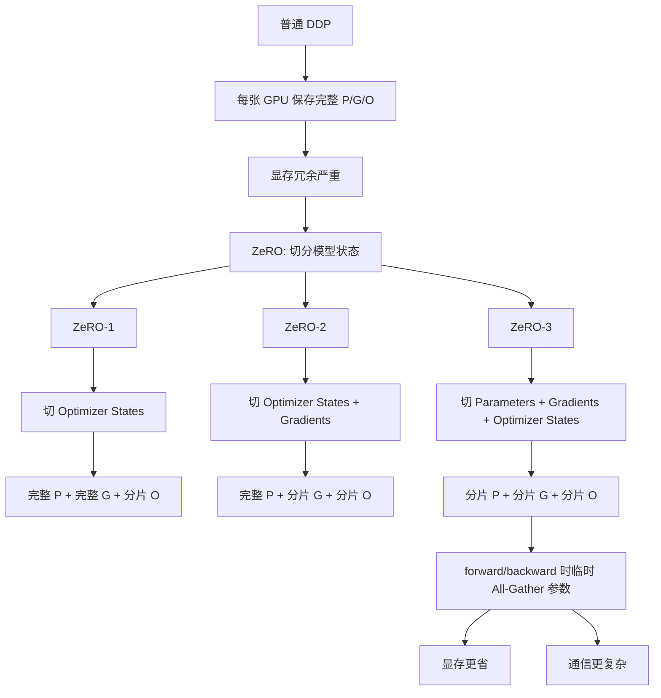

## 1. 文章主题概览

这篇博客主要讲的是 **ZeRO：Zero Redundancy Optimizer，零冗余优化器**。

它要解决的问题是：

> 普通 DDP 虽然能让多张 GPU 并行训练，但是每张 GPU 都重复保存完整的模型状态，显存浪费非常严重。

普通 DDP 中，每张 GPU 都保存：

```text
完整参数 Parameters
完整梯度 Gradients
完整优化器状态 Optimizer States
```

假设有 4 张 GPU，普通 DDP 的状态大概是：

```text
GPU0: 完整 P + 完整 G + 完整 O
GPU1: 完整 P + 完整 G + 完整 O
GPU2: 完整 P + 完整 G + 完整 O
GPU3: 完整 P + 完整 G + 完整 O
```

这里的：

```text
P = Parameters，模型参数
G = Gradients，梯度
O = Optimizer States，优化器状态
```

ZeRO 的核心思想就是：

> 既然这些状态在每张 GPU 上重复保存太浪费，那就把它们切分到不同 GPU 上，每张 GPU 只保存一部分。

---

# 2. 训练显存到底由什么组成？

训练大模型时，显存不是只被模型参数占用。

主要可以分成两大类：

```text
1. Model States：模型状态
2. Residual States：剩余状态
```

---

## 2.1 Model States：模型状态

Model States 主要包括：

```text
Parameters：模型参数
Gradients：梯度
Optimizer States：优化器状态
```

以 Adam / AdamW 为例，对于每个参数，训练时通常需要保存：

```text
参数本体 W
梯度 grad
一阶动量 m
二阶动量 v
```

如果是混合精度训练，可能还会有：

```text
FP16 / BF16 参数
FP32 master weights
```

所以训练时的显存开销远大于单纯的模型参数大小。

---

## 2.2 Residual States：剩余状态

Residual States 主要包括：

```text
Activations：前向传播产生的中间激活
Temporary Buffers：临时 buffer
Memory Fragmentation：显存碎片
```

例如前面 GPipe 里讲的：

```text
activation checkpointing / re-materialization
```

主要优化的是：

```text
Activations 中间激活显存
```

而 ZeRO 主要优化的是：

```text
Parameters + Gradients + Optimizer States 的冗余存储
```

---

# 3. 普通 DDP 为什么显存浪费？

普通 DDP 的特点是：

```text
每张 GPU 保存完整模型
每张 GPU 处理不同数据
每张 GPU 算完整梯度
最后通过 AllReduce 同步梯度
```

假设模型状态可以分成 4 块：

```text
P = [P0, P1, P2, P3]
G = [G0, G1, G2, G3]
O = [O0, O1, O2, O3]
```

普通 DDP 中，每张 GPU 都有完整状态：

```text
GPU0: [P0,P1,P2,P3] + [G0,G1,G2,G3] + [O0,O1,O2,O3]
GPU1: [P0,P1,P2,P3] + [G0,G1,G2,G3] + [O0,O1,O2,O3]
GPU2: [P0,P1,P2,P3] + [G0,G1,G2,G3] + [O0,O1,O2,O3]
GPU3: [P0,P1,P2,P3] + [G0,G1,G2,G3] + [O0,O1,O2,O3]
```

也就是说：

```text
参数重复 4 份
梯度重复 4 份
优化器状态重复 4 份
```

这就是普通数据并行中的显存冗余。

---

# 4. ZeRO 的核心思想

ZeRO 的全称是：

```text
Zero Redundancy Optimizer
```

也就是：

```text
零冗余优化器
```

核心思想：

```text
普通 DDP：
每张 GPU 都完整保存 P/G/O。

ZeRO：
把 P/G/O 按数据并行组切分，每张 GPU 只保存一部分。
```

普通 DDP：

```text
GPU0: 完整模型状态
GPU1: 完整模型状态
GPU2: 完整模型状态
GPU3: 完整模型状态
```

ZeRO：

```text
GPU0: 模型状态的 1/4
GPU1: 模型状态的 1/4
GPU2: 模型状态的 1/4
GPU3: 模型状态的 1/4
```

所以 ZeRO 本质上是：

> **在数据并行基础上，对模型状态存储方式做切分，减少重复保存。**

---

# 5. ZeRO 的三个阶段

ZeRO 通常分成三个阶段：

| 阶段 | 切分对象 | 简单理解 |
|---|---|---|
| **ZeRO-1** | Optimizer States | 只切优化器状态 |
| **ZeRO-2** | Optimizer States + Gradients | 再把梯度也切了 |
| **ZeRO-3** | Optimizer States + Gradients + Parameters | 连参数也切了 |

可以记成：

```text
ZeRO-1：切 O
ZeRO-2：切 O + G
ZeRO-3：切 O + G + P
```

其中：

```text
O = Optimizer States
G = Gradients
P = Parameters
```

---

# 6. ZeRO-1：只切优化器状态

## 6.1 ZeRO-1 的状态分布

ZeRO-1 中：

```text
参数 P：每张 GPU 完整保存
梯度 G：每张 GPU 完整保存
优化器状态 O：切分保存
```

所以状态是：

```text
GPU0: 完整 P + 完整 G + O0
GPU1: 完整 P + 完整 G + O1
GPU2: 完整 P + 完整 G + O2
GPU3: 完整 P + 完整 G + O3
```

也就是：

```text
GPU0: [P0,P1,P2,P3] + [G0,G1,G2,G3] + [O0]
GPU1: [P0,P1,P2,P3] + [G0,G1,G2,G3] + [O1]
GPU2: [P0,P1,P2,P3] + [G0,G1,G2,G3] + [O2]
GPU3: [P0,P1,P2,P3] + [G0,G1,G2,G3] + [O3]
```

---

## 6.2 ZeRO-1 forward 流程

因为每张 GPU 都有完整参数，所以 forward 和普通 DDP 基本一样。

```text
GPU0: data0 + 完整 P → loss0
GPU1: data1 + 完整 P → loss1
GPU2: data2 + 完整 P → loss2
GPU3: data3 + 完整 P → loss3
```

ZeRO-1 的 forward 不需要额外 All-Gather 参数。

---

## 6.3 ZeRO-1 backward 流程

每张 GPU 根据自己的数据算出完整本地梯度：

```text
GPU0: [G0_0, G1_0, G2_0, G3_0]
GPU1: [G0_1, G1_1, G2_1, G3_1]
GPU2: [G0_2, G1_2, G2_2, G3_2]
GPU3: [G0_3, G1_3, G2_3, G3_3]
```

这里：

```text
G0_0 = GPU0 根据 data0 算出来的 P0 对应梯度
G0_1 = GPU1 根据 data1 算出来的 P0 对应梯度
G0_2 = GPU2 根据 data2 算出来的 P0 对应梯度
G0_3 = GPU3 根据 data3 算出来的 P0 对应梯度
```

然后通过 AllReduce 聚合梯度：

```text
G0 = G0_0 + G0_1 + G0_2 + G0_3
G1 = G1_0 + G1_1 + G1_2 + G1_3
G2 = G2_0 + G2_1 + G2_2 + G2_3
G3 = G3_0 + G3_1 + G3_2 + G3_3
```

最后每张 GPU 都拿到完整聚合梯度：

```text
GPU0: [G0, G1, G2, G3]
GPU1: [G0, G1, G2, G3]
GPU2: [G0, G1, G2, G3]
GPU3: [G0, G1, G2, G3]
```

所以 ZeRO-1 的 backward 和普通 DDP 很像。

---

## 6.4 ZeRO-1 optimizer step 流程

区别主要发生在 optimizer step。

因为优化器状态被切分了：

```text
GPU0 只有 O0
GPU1 只有 O1
GPU2 只有 O2
GPU3 只有 O3
```

所以每张 GPU 只负责更新自己那一块参数：

```text
GPU0: 用 O0 + G0 更新 P0
GPU1: 用 O1 + G1 更新 P1
GPU2: 用 O2 + G2 更新 P2
GPU3: 用 O3 + G3 更新 P3
```

更新后：

```text
GPU0 得到 P0_new
GPU1 得到 P1_new
GPU2 得到 P2_new
GPU3 得到 P3_new
```

但是下一轮 forward 每张 GPU 仍然需要完整参数，所以要把更新后的参数块同步给所有 GPU。

也就是做一次 All-Gather：

```text
GPU0 把 P0_new 发给所有 GPU
GPU1 把 P1_new 发给所有 GPU
GPU2 把 P2_new 发给所有 GPU
GPU3 把 P3_new 发给所有 GPU
```

最后每张 GPU 又恢复完整最新参数：

```text
GPU0: [P0_new, P1_new, P2_new, P3_new]
GPU1: [P0_new, P1_new, P2_new, P3_new]
GPU2: [P0_new, P1_new, P2_new, P3_new]
GPU3: [P0_new, P1_new, P2_new, P3_new]
```

---

## 6.5 ZeRO-1 总结

```text
ZeRO-1：
forward 和普通 DDP 一样；
backward 基本和普通 DDP 一样；
optimizer step 时，每张 GPU 只更新自己负责的参数块；
更新后需要 All-Gather 参数，让所有 GPU 恢复完整参数。
```

ZeRO-1 省的是：

```text
优化器状态 O 的冗余
```

---

# 7. ZeRO-2：切优化器状态 + 梯度

## 7.1 ZeRO-2 的状态分布

ZeRO-2 中：

```text
参数 P：每张 GPU 完整保存
梯度 G：切分保存
优化器状态 O：切分保存
```

状态是：

```text
GPU0: 完整 P + G0 + O0
GPU1: 完整 P + G1 + O1
GPU2: 完整 P + G2 + O2
GPU3: 完整 P + G3 + O3
```

也就是：

```text
GPU0: [P0,P1,P2,P3] + [G0] + [O0]
GPU1: [P0,P1,P2,P3] + [G1] + [O1]
GPU2: [P0,P1,P2,P3] + [G2] + [O2]
GPU3: [P0,P1,P2,P3] + [G3] + [O3]
```

---

## 7.2 ZeRO-2 forward 流程

因为参数仍然完整保存，所以 forward 仍然和普通 DDP 一样：

```text
GPU0: data0 + 完整 P → loss0
GPU1: data1 + 完整 P → loss1
GPU2: data2 + 完整 P → loss2
GPU3: data3 + 完整 P → loss3
```

ZeRO-2 forward 不需要临时拼参数。

---

## 7.3 ZeRO-2 backward 流程

每张 GPU backward 时，会根据自己的数据产生本地梯度。

理论上每张 GPU 都可以算出完整本地梯度：

```text
GPU0: [G0_0, G1_0, G2_0, G3_0]
GPU1: [G0_1, G1_1, G2_1, G3_1]
GPU2: [G0_2, G1_2, G2_2, G3_2]
GPU3: [G0_3, G1_3, G2_3, G3_3]
```

但是 ZeRO-2 不希望每张 GPU 最终都保存完整聚合梯度。

普通 DDP 会 AllReduce，最后每张 GPU 都得到：

```text
GPU0: [G0, G1, G2, G3]
GPU1: [G0, G1, G2, G3]
GPU2: [G0, G1, G2, G3]
GPU3: [G0, G1, G2, G3]
```

ZeRO-2 更像是做 **Reduce-Scatter**：

```text
GPU0 最终只保留 G0 = G0_0 + G0_1 + G0_2 + G0_3
GPU1 最终只保留 G1 = G1_0 + G1_1 + G1_2 + G1_3
GPU2 最终只保留 G2 = G2_0 + G2_1 + G2_2 + G2_3
GPU3 最终只保留 G3 = G3_0 + G3_1 + G3_2 + G3_3
```

最终状态：

```text
GPU0: 聚合后的 G0
GPU1: 聚合后的 G1
GPU2: 聚合后的 G2
GPU3: 聚合后的 G3
```

这就是 ZeRO-2 的关键：

> 梯度不再每张 GPU 都完整保存，而是每张 GPU 只保存自己负责的梯度分片。

---

## 7.4 ZeRO-2 optimizer step 流程

此时每张 GPU 有：

```text
GPU0: 完整 P + G0 + O0
GPU1: 完整 P + G1 + O1
GPU2: 完整 P + G2 + O2
GPU3: 完整 P + G3 + O3
```

所以每张 GPU 只负责更新自己的参数块：

```text
GPU0: 用 G0 + O0 更新 P0
GPU1: 用 G1 + O1 更新 P1
GPU2: 用 G2 + O2 更新 P2
GPU3: 用 G3 + O3 更新 P3
```

更新后：

```text
GPU0 得到 P0_new
GPU1 得到 P1_new
GPU2 得到 P2_new
GPU3 得到 P3_new
```

但下一轮 forward 每张 GPU 仍然需要完整参数，所以还需要 All-Gather 参数：

```text
GPU0/GPU1/GPU2/GPU3 互相交换 P0_new, P1_new, P2_new, P3_new
```

最后每张 GPU 都恢复完整最新参数：

```text
GPU0: [P0_new, P1_new, P2_new, P3_new]
GPU1: [P0_new, P1_new, P2_new, P3_new]
GPU2: [P0_new, P1_new, P2_new, P3_new]
GPU3: [P0_new, P1_new, P2_new, P3_new]
```

---

## 7.5 ZeRO-2 总结

```text
ZeRO-2：
forward 和普通 DDP 一样；
backward 不再让每张 GPU 保存完整梯度；
而是通过 Reduce-Scatter，让每张 GPU 只保存聚合后的梯度分片；
optimizer step 中，每张 GPU 用自己的 G/O 分片更新对应参数块；
更新后再 All-Gather 参数。
```

ZeRO-2 省的是：

```text
优化器状态 O 的冗余
+
梯度 G 的冗余
```

---

# 8. ZeRO-3：参数、梯度、优化器状态全切

## 8.1 ZeRO-3 的状态分布

ZeRO-3 中：

```text
参数 P：切分保存
梯度 G：切分保存
优化器状态 O：切分保存
```

状态是：

```text
GPU0: P0 + G0 + O0
GPU1: P1 + G1 + O1
GPU2: P2 + G2 + O2
GPU3: P3 + G3 + O3
```

也就是：

```text
GPU0: [P0] + [G0] + [O0]
GPU1: [P1] + [G1] + [O1]
GPU2: [P2] + [G2] + [O2]
GPU3: [P3] + [G3] + [O3]
```

这时每张 GPU 常驻显存里已经没有完整模型参数。

问题来了：

> forward 不是需要完整参数吗？每张 GPU 只有一部分参数，怎么计算？

答案是：

```text
需要某一层参数时，临时 All-Gather 当前层完整参数；
算完这一层之后，释放临时完整参数。
```

---

# 9. ZeRO-3 的 forward / backward 完整例子

为了讲清楚 ZeRO-3，假设模型只有两层：

```text
Layer1 参数：W1
Layer2 参数：W2
```

每层参数都切成 4 份：

```text
W1 = [W1_0, W1_1, W1_2, W1_3]
W2 = [W2_0, W2_1, W2_2, W2_3]
```

4 张 GPU 常驻保存：

```text
GPU0: W1_0 + W2_0
GPU1: W1_1 + W2_1
GPU2: W1_2 + W2_2
GPU3: W1_3 + W2_3
```

---

## 9.1 ZeRO-3 forward：计算 Layer1

计算 Layer1 需要完整 W1。

当前每张 GPU 只有：

```text
GPU0: W1_0
GPU1: W1_1
GPU2: W1_2
GPU3: W1_3
```

所以先 All-Gather W1：

```text
GPU0/GPU1/GPU2/GPU3 互相交换 W1 分片
```

每张 GPU 临时得到完整 W1：

```text
GPU0: 临时 W1 = [W1_0,W1_1,W1_2,W1_3]
GPU1: 临时 W1 = [W1_0,W1_1,W1_2,W1_3]
GPU2: 临时 W1 = [W1_0,W1_1,W1_2,W1_3]
GPU3: 临时 W1 = [W1_0,W1_1,W1_2,W1_3]
```

然后每张 GPU 用自己的数据计算 Layer1：

```text
GPU0: h0 = Layer1(data0, W1)
GPU1: h1 = Layer1(data1, W1)
GPU2: h2 = Layer1(data2, W1)
GPU3: h3 = Layer1(data3, W1)
```

Layer1 算完后，释放临时完整 W1。

常驻状态又变回：

```text
GPU0: W1_0
GPU1: W1_1
GPU2: W1_2
GPU3: W1_3
```

---

## 9.2 ZeRO-3 forward：计算 Layer2

计算 Layer2 需要完整 W2。

当前每张 GPU 只有：

```text
GPU0: W2_0
GPU1: W2_1
GPU2: W2_2
GPU3: W2_3
```

所以 All-Gather W2：

```text
GPU0/GPU1/GPU2/GPU3 互相交换 W2 分片
```

每张 GPU 临时得到完整 W2：

```text
GPU0: 临时 W2 = [W2_0,W2_1,W2_2,W2_3]
GPU1: 临时 W2 = [W2_0,W2_1,W2_2,W2_3]
GPU2: 临时 W2 = [W2_0,W2_1,W2_2,W2_3]
GPU3: 临时 W2 = [W2_0,W2_1,W2_2,W2_3]
```

然后每张 GPU 用自己的 h 计算 Layer2：

```text
GPU0: y0 = Layer2(h0, W2)
GPU1: y1 = Layer2(h1, W2)
GPU2: y2 = Layer2(h2, W2)
GPU3: y3 = Layer2(h3, W2)
```

计算 loss：

```text
GPU0: loss0
GPU1: loss1
GPU2: loss2
GPU3: loss3
```

Layer2 算完后，释放临时完整 W2。

---

## 9.3 ZeRO-3 forward 总结

ZeRO-3 的 forward 是：

```text
算 Layer1 前：
All-Gather W1 → 算 Layer1 → 释放完整 W1

算 Layer2 前：
All-Gather W2 → 算 Layer2 → 释放完整 W2
```

一句话：

```text
ZeRO-3 不常驻完整参数；
每层计算前临时拼出当前层完整参数；
算完就释放。
```

---

## 9.4 ZeRO-3 backward：反向到 Layer2

backward 是从后往前：

```text
Layer2 backward
Layer1 backward
```

计算 Layer2 的梯度需要 W2，所以还要再次 All-Gather W2。

当前每张 GPU 只有 W2 分片：

```text
GPU0: W2_0
GPU1: W2_1
GPU2: W2_2
GPU3: W2_3
```

All-Gather 后，每张 GPU 临时得到完整 W2：

```text
GPU0: 临时完整 W2
GPU1: 临时完整 W2
GPU2: 临时完整 W2
GPU3: 临时完整 W2
```

然后每张 GPU 根据自己的 loss 算本地梯度：

```text
GPU0: 根据 data0 算 W2 的本地梯度
GPU1: 根据 data1 算 W2 的本地梯度
GPU2: 根据 data2 算 W2 的本地梯度
GPU3: 根据 data3 算 W2 的本地梯度
```

然后对 W2 的梯度做 Reduce-Scatter。

假设 W2 的梯度也切成 4 块：

```text
dW2 = [dW2_0, dW2_1, dW2_2, dW2_3]
```

Reduce-Scatter 后：

```text
GPU0: 聚合后的 dW2_0
GPU1: 聚合后的 dW2_1
GPU2: 聚合后的 dW2_2
GPU3: 聚合后的 dW2_3
```

最后释放临时完整 W2。

---

## 9.5 ZeRO-3 backward：反向到 Layer1

计算 Layer1 的梯度需要完整 W1。

所以先 All-Gather W1：

```text
GPU0/GPU1/GPU2/GPU3 互相交换 W1 分片
```

每张 GPU 临时得到完整 W1。

然后每张 GPU 根据自己的数据和反传梯度，计算 W1 的本地梯度。

然后对 W1 的梯度做 Reduce-Scatter：

```text
GPU0: 聚合后的 dW1_0
GPU1: 聚合后的 dW1_1
GPU2: 聚合后的 dW1_2
GPU3: 聚合后的 dW1_3
```

最后释放临时完整 W1。

---

## 9.6 ZeRO-3 backward 总结

ZeRO-3 的 backward 是：

```text
backward Layer2：
All-Gather W2 → 计算本地 dW2 → Reduce-Scatter dW2 → 释放完整 W2

backward Layer1：
All-Gather W1 → 计算本地 dW1 → Reduce-Scatter dW1 → 释放完整 W1
```

最终每张 GPU 只保存自己负责的梯度分片：

```text
GPU0: dW1_0 + dW2_0
GPU1: dW1_1 + dW2_1
GPU2: dW1_2 + dW2_2
GPU3: dW1_3 + dW2_3
```

---

## 9.7 ZeRO-3 optimizer step

现在每张 GPU 有：

```text
GPU0: 参数分片 P0 + 梯度分片 G0 + 优化器状态分片 O0
GPU1: 参数分片 P1 + 梯度分片 G1 + 优化器状态分片 O1
GPU2: 参数分片 P2 + 梯度分片 G2 + 优化器状态分片 O2
GPU3: 参数分片 P3 + 梯度分片 G3 + 优化器状态分片 O3
```

所以每张 GPU 直接更新自己负责的参数分片：

```text
GPU0: 用 G0 + O0 更新 P0
GPU1: 用 G1 + O1 更新 P1
GPU2: 用 G2 + O2 更新 P2
GPU3: 用 G3 + O3 更新 P3
```

注意：

```text
ZeRO-3 更新完参数后，不需要像 ZeRO-1 / ZeRO-2 那样立刻 All-Gather 完整参数常驻起来。
```

因为 ZeRO-3 本来就不要求每张 GPU 常驻完整参数。

下一轮 forward 时：

```text
需要哪一层参数，再临时 All-Gather 哪一层。
```

---

# 10. 三个 Stage 的完整流程对比

| 阶段 | Forward | Backward | Optimizer Step | 常驻状态 |
|---|---|---|---|---|
| **DDP** | 直接用完整参数 | AllReduce 得到完整梯度 | 每张卡更新完整参数 | 完整 P/G/O |
| **ZeRO-1** | 直接用完整参数 | AllReduce 得到完整梯度 | 每卡更新一块参数，再 All-Gather 参数 | 完整 P/G，分片 O |
| **ZeRO-2** | 直接用完整参数 | Reduce-Scatter 得到梯度分片 | 每卡更新一块参数，再 All-Gather 参数 | 完整 P，分片 G/O |
| **ZeRO-3** | 每层临时 All-Gather 参数 | 每层临时 Gather 参数，梯度 Reduce-Scatter | 每卡更新自己的参数分片 | 分片 P/G/O |

---

# 11. 我们讨论过的重点一：ZeRO 的切分是在 layer 之间还是 layer 内部？

这里非常容易和 GPipe 混淆。

结论：

> ZeRO 的切分不是按 layer 之间切，而是按参数、梯度、优化器状态的存储切分。

也就是说，ZeRO-3 不是：

```text
GPU0: Layer1
GPU1: Layer2
GPU2: Layer3
GPU3: Layer4
```

这种是 GPipe / Pipeline Parallelism 的切法。

ZeRO-3 更像是：

```text
Layer1 的参数 W1 被切成 4 份：
W1 = [W1_0, W1_1, W1_2, W1_3]

Layer2 的参数 W2 被切成 4 份：
W2 = [W2_0, W2_1, W2_2, W2_3]
```

然后分到不同 GPU：

```text
GPU0: W1_0 + W2_0
GPU1: W1_1 + W2_1
GPU2: W1_2 + W2_2
GPU3: W1_3 + W2_3
```

所以可以理解成：

```text
ZeRO 是按参数张量 / 参数组切分。
```

实际工程里，可能会把参数 flatten 成大的 buffer，然后按 rank 切成 shards。

所以更准确的说法是：

> **ZeRO 是按模型状态的存储切分，不是按网络层的计算图切分。**

---

# 12. 我们讨论过的重点二：ZeRO-3 和 Tensor Parallelism 有什么区别？

ZeRO-3 和 Tensor Parallelism 都可能涉及 layer 内部参数切分，但它们目的不同。

---

## 12.1 Tensor Parallelism

Tensor Parallelism 是为了：

```text
分摊计算
```

比如线性层：

```text
Y = XW
```

Tensor Parallelism 会把 W 按行或列切开：

```text
GPU0: W 的一部分
GPU1: W 的一部分
```

然后不同 GPU 各自算一部分输出，再做通信合并。

也就是说：

```text
参数切了，计算也切了。
```

---

## 12.2 ZeRO-3

ZeRO-3 是为了：

```text
减少常驻显存
```

虽然参数常驻存储被切了，但计算某一层时会临时 All-Gather 出完整参数：

```text
需要 W → All-Gather 完整 W → 每张 GPU 用完整 W 计算自己的数据 → 释放 W
```

也就是说：

```text
参数常驻存储切了，但每张 GPU 逻辑上仍然执行完整模型计算。
```

---

## 12.3 对比表

| 方法 | 参数是否切 | 计算是否切 | 核心目的 |
|---|---|---|---|
| **Tensor Parallelism** | 切 | 切 | 分摊单层计算 |
| **ZeRO-3** | 常驻存储切 | 计算时临时 gather，不主要切计算 | 减少模型状态显存 |
| **Pipeline Parallelism / GPipe** | 按 layer 切 | 不同 GPU 算不同 layer | 按层分摊计算图 |

---

# 13. 我们讨论过的重点三：ZeRO 相比 GPipe 有什么好处？

GPipe / Pipeline Parallelism 是：

```text
按 layer 切模型
```

例如模型 8 层：

```text
Layer0 Layer1 Layer2 Layer3 Layer4 Layer5 Layer6 Layer7
```

GPipe 可能这样切：

```text
GPU0: Layer0 Layer1
GPU1: Layer2 Layer3
GPU2: Layer4 Layer5
GPU3: Layer6 Layer7
```

一个样本 forward 时要跨 GPU 流动：

```text
data → GPU0 → GPU1 → GPU2 → GPU3 → loss
```

也就是说：

```text
GPipe 是切计算图。
```

ZeRO 则是：

```text
每张 GPU 逻辑上仍然跑完整模型；
但是参数、梯度、优化器状态不再每张 GPU 都完整保存。
```

也就是说：

```text
ZeRO 是切模型状态。
```

---

## 13.1 GPipe 的问题

GPipe 有几个典型问题：

```text
1. 有 pipeline bubble
2. 需要手动或自动平衡 layer 切分
3. 不同 stage 负载不均会拖慢整体速度
4. 需要在 stage 之间传 activation
5. micro-batch 调度复杂
```

例如：

```text
GPU0: 前几层，计算很轻
GPU1: 中间几层，计算很重
GPU2: 后几层，计算中等
```

整个 pipeline 的速度会被最慢的 GPU 卡住。

---

## 13.2 ZeRO 的好处

ZeRO 的好处是：

```text
1. 不需要把 layer 分给不同 GPU
2. 没有典型 pipeline bubble
3. 每张 GPU 处理不同数据，计算负载更对称
4. 训练语义更接近 DDP
5. 直接减少 DDP 中 P/G/O 的冗余存储
```

所以 ZeRO 可以理解成：

```text
DDP + 模型状态分片
```

而不是：

```text
按层切模型
```

---

# 14. 我们讨论过的重点四：为什么 GPipe 不像 ZeRO-3 一样每次计算前 All-Gather 参数？

这是一个非常关键的问题。

表面上看：

```text
GPipe：每张 GPU 存模型的一部分
ZeRO-3：每张 GPU 也存模型的一部分
```

那为什么 GPipe 不让每个 GPU 在计算前 All-Gather 完整参数呢？

答案是：

> 可以这么做，但那就不叫 GPipe 了，而更像 ZeRO-3 / FSDP。

---

## 14.1 GPipe 的核心是切计算

GPipe 的目标是：

```text
把不同 layer 的计算分摊到不同 GPU 上。
```

例如：

```text
GPU0: 算 Layer1
GPU1: 算 Layer2
GPU2: 算 Layer3
GPU3: 算 Layer4
```

每张 GPU 只负责一段模型。

如果每张 GPU 都 All-Gather 完整模型，然后每张 GPU 都跑完整模型：

```text
GPU0: 算 Layer1~Layer4
GPU1: 算 Layer1~Layer4
GPU2: 算 Layer1~Layer4
GPU3: 算 Layer1~Layer4
```

这就不是 pipeline parallelism 了，而是：

```text
数据并行 + 参数分片
```

也就是 ZeRO-3 / FSDP 的思路。

---

## 14.2 GPipe 是参数不动，activation 动

GPipe 中，参数常驻在负责该 layer 的 GPU 上。

例如：

```text
GPU0: Layer1 参数
GPU1: Layer2 参数
GPU2: Layer3 参数
GPU3: Layer4 参数
```

forward 时数据流动：

```text
data → GPU0 算 Layer1 → activation h1
h1 → GPU1 算 Layer2 → activation h2
h2 → GPU2 算 Layer3 → activation h3
h3 → GPU3 算 Layer4
```

所以 GPipe 的通信主要是：

```text
activation 从前一个 stage 传到后一个 stage
```

可以总结为：

```text
GPipe：参数不动，activation 动，计算被切开。
```

---

## 14.3 ZeRO-3 是 activation 不跨 stage 流，参数临时动

ZeRO-3 中，每张 GPU 处理自己的数据：

```text
GPU0: data0
GPU1: data1
GPU2: data2
GPU3: data3
```

每张 GPU 逻辑上都跑完整模型。

但是参数常驻是分片的：

```text
GPU0: 参数分片 0
GPU1: 参数分片 1
GPU2: 参数分片 2
GPU3: 参数分片 3
```

计算某一层前：

```text
All-Gather 当前层参数
```

算完释放。

所以 ZeRO-3 可以总结为：

```text
ZeRO-3：参数动，activation 不按 pipeline stage 流，存储被切开。
```

---

## 14.4 本质区别

| 对比项 | GPipe | ZeRO-3 |
|---|---|---|
| 常驻存储 | 每张 GPU 存部分 layer | 每张 GPU 存每层参数的一部分 |
| 计算方式 | 每张 GPU 只算一段 layer | 每张 GPU 逻辑上跑完整模型 |
| 通信内容 | activation / activation grad | 参数 All-Gather + 梯度 Reduce-Scatter |
| 核心目标 | 分摊计算图 | 减少模型状态冗余 |
| 是否数据并行 | 通常要和数据并行组合 | 本质是数据并行的显存优化 |
| 是否有 pipeline bubble | 有 | 没有典型 pipeline bubble |

---

# 15. 一个类比：GPipe 和 ZeRO-3

## 15.1 GPipe：流水线工厂

GPipe 像一个工厂流水线：

```text
工人 A 只负责第一道工序
工人 B 只负责第二道工序
工人 C 只负责第三道工序
```

产品从 A 流到 B，再流到 C。

对应到训练中：

```text
参数不动，activation 动。
```

---

## 15.2 ZeRO-3：工具共享

ZeRO-3 像是：

```text
每个工人都会做完整产品，
但是工具很贵，不能每个人都有完整一套。
所以工具分散存放。
需要某个工具时，临时把工具借过来；
用完再还回去。
```

对应到训练中：

```text
每张 GPU 都处理自己的数据；
参数分片存放；
需要某一层参数时临时 All-Gather；
算完释放。
```

---

# 16. ZeRO 和 GPipe 不是谁完全替代谁

ZeRO 和 GPipe 解决的是不同维度的问题。

```text
ZeRO：
解决数据并行中模型状态重复保存的问题。

GPipe：
解决模型计算图和层参数如何跨设备分布的问题。
```

在超大模型训练中，它们可以组合使用：

```text
数据并行 + ZeRO
张量并行 Tensor Parallelism
流水线并行 Pipeline Parallelism
Activation Checkpointing
```

各自负责不同问题：

| 技术 | 主要解决什么 |
|---|---|
| **ZeRO** | P/G/O 模型状态冗余 |
| **Tensor Parallelism** | 单层矩阵太大，单层计算太重 |
| **Pipeline Parallelism** | 模型层数太多，按层切计算图 |
| **Activation Checkpointing** | 中间激活太占显存 |

---

# 17. ZeRO-Offload 和 ZeRO-Infinity 简要理解

除了 ZeRO-1/2/3，DeepSpeed 里还会提到：

```text
ZeRO-Offload
ZeRO-Infinity
```

它们的核心是：

> 把一部分原本放在 GPU 显存里的状态，挪到 CPU 内存甚至 NVMe 硬盘上。

可以理解为：

```text
GPU 显存：快，但小
CPU 内存：慢一些，但大
NVMe 硬盘：更慢，但更大
```

Offload 的本质是：

```text
用更慢的存储换更大的容量。
```

优点：

```text
可以进一步降低 GPU 显存压力
可以训练更大的模型
```

缺点：

```text
CPU / NVMe 和 GPU 之间的数据传输会变慢
如果调度不好，训练速度会明显下降
```

所以 Offload 适合：

```text
显存确实不够，但可以接受训练变慢
```

---

# 18. 文章主线总结

这篇博客的主线可以这样理解：

```text
普通 DDP 能让多张 GPU 并行处理不同数据
    ↓
但是每张 GPU 都完整保存参数、梯度、优化器状态
    ↓
这些模型状态在数据并行中高度冗余
    ↓
ZeRO 提出把模型状态切分到不同 GPU 上
    ↓
ZeRO-1：切优化器状态
    ↓
ZeRO-2：进一步切梯度
    ↓
ZeRO-3：进一步切参数
    ↓
越往后越省显存，但通信越复杂
```

---

# 19. 总流程图



---

# 20. 面试版回答

## 20.1 如果面试官问：ZeRO 是什么？

可以回答：

```text
ZeRO 是 DeepSpeed 中用于大模型训练的显存优化技术，
全称是 Zero Redundancy Optimizer。

它针对普通数据并行中每张 GPU 都重复保存完整参数、梯度和优化器状态的问题，
通过把这些模型状态切分到不同 GPU 上，
减少数据并行中的显存冗余。
```

---

## 20.2 如果面试官问：ZeRO 三个阶段有什么区别？

可以回答：

```text
ZeRO 分为三个阶段。

ZeRO-1 只切分 optimizer states，
每张 GPU 仍然保存完整参数和完整梯度。

ZeRO-2 在 ZeRO-1 的基础上进一步切分 gradients，
每张 GPU 仍然保存完整参数，
但只保存自己负责的梯度分片和优化器状态分片。

ZeRO-3 进一步切分 parameters，
参数、梯度、优化器状态都被分片保存。
forward 和 backward 时，
需要某一层参数就临时 All-Gather，
计算完成后再释放完整参数。
```

---

## 20.3 如果面试官问：ZeRO-3 为什么更省显存但通信更多？

可以回答：

```text
因为 ZeRO-3 连模型参数都不再每张 GPU 常驻完整一份，
每张 GPU 只保存参数分片、梯度分片和优化器状态分片，
所以显存节省最大。

但计算某一层时，每张 GPU 需要完整的该层参数，
所以 forward 和 backward 过程中需要临时 All-Gather 参数。
反向传播得到梯度后，还需要 Reduce-Scatter 梯度，
让每张 GPU 只保留自己负责的梯度分片。

因此 ZeRO-3 是用更多通信换更低显存。
```

---

## 20.4 如果面试官问：ZeRO 的切分是 layer 之间切还是 layer 内部切？

可以回答：

```text
ZeRO 不是像 GPipe 那样按 layer 之间切分模型，
而是按参数、梯度和优化器状态的存储进行切分。

ZeRO-3 中，每一层参数本身也可能被切成多个 shard，
分别放在不同 GPU 上。
计算某一层时，再临时 All-Gather 出这一层完整参数。

所以 ZeRO 是切模型状态，不是切模型计算图。
```

---

## 20.5 如果面试官问：ZeRO 和 GPipe 有什么区别？

可以回答：

```text
GPipe 是 Pipeline Parallelism，
它按 layer 切分模型计算图，
不同 GPU 负责不同 layer，
activation 在 GPU 之间流动。
它的目标是把模型计算和参数按层分摊到多张 GPU 上。

ZeRO 是数据并行下的显存优化，
它不按 layer 切计算图，
每张 GPU 逻辑上仍然执行完整模型，
只是把参数、梯度和优化器状态切分存储。
ZeRO-3 在计算某层时临时 All-Gather 参数，
算完释放。

所以 GPipe 是切计算图，
ZeRO 是切模型状态。
```

---

## 20.6 如果面试官问：GPipe 为什么不也在计算前 All-Gather 参数？

可以回答：

```text
如果 GPipe 在计算前 All-Gather 参数，
让每张 GPU 都临时拿到完整参数并执行完整模型，
那它就不再是 Pipeline Parallelism，
而更像 ZeRO-3 / FSDP。

GPipe 的核心目标是让不同 GPU 负责不同层的计算，
也就是把计算图切开。
参数常驻在对应 stage 上，
activation 从一个 stage 流到下一个 stage。

ZeRO-3 的核心目标是减少模型状态冗余，
每张 GPU 逻辑上仍然跑完整模型，
但是参数分片存储，需要时临时 All-Gather。

所以 GPipe 是参数不动、activation 动；
ZeRO-3 是参数临时动、每张 GPU 处理自己的数据。
```

---

# 21. 最重要的记忆版总结

```text
普通 DDP：
每张 GPU 都保存完整 P/G/O，显存冗余大。

ZeRO：
把 P/G/O 切分到不同 GPU 上，减少冗余。

ZeRO-1：
切优化器状态 O。
forward/backward 基本像 DDP，
optimizer step 时每张 GPU 只更新自己负责的参数块。

ZeRO-2：
切优化器状态 O + 梯度 G。
forward 像 DDP，
backward 用 Reduce-Scatter 让每张 GPU 只保留梯度分片。

ZeRO-3：
切优化器状态 O + 梯度 G + 参数 P。
每张 GPU 常驻只有参数分片，
forward/backward 时按层临时 All-Gather 参数，
梯度通过 Reduce-Scatter 分片保存。

ZeRO 切的是模型状态，不是按 layer 切计算图。
GPipe 切的是计算图，不同 GPU 负责不同 layer。

GPipe：
参数不动，activation 动，计算被切开。

ZeRO-3：
参数临时动，计算逻辑不按层切，每张 GPU 处理自己的数据。

越往 ZeRO 后面的 stage，显存越省，但通信越复杂。
```